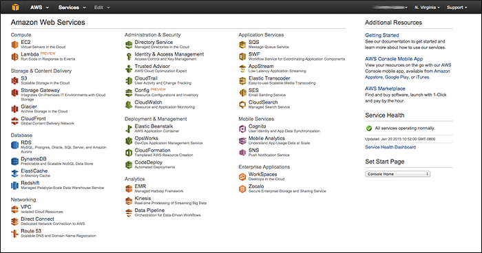
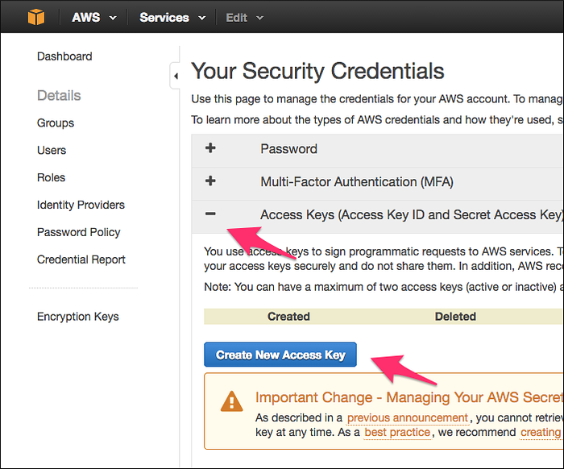
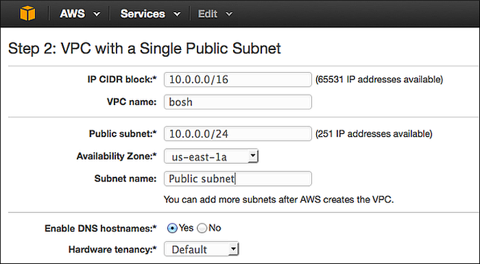

## Table of Contents
1. [문서 개요](#1--문서-개요)
     * [목적](#11--목적)
     * [범위](#12--범위)
     * [참고자료](#13--참고자료)
2. [환경 준비](#2--환경-준비)
     * [설치전 준비사항](#21--설치전-준비사항)
     * [AWS 환경 구성](#22--aws-환경-구성)
     * [RUBY 설치](#23--ruby-설치)
     * [BOSH 설치](#24--bosh-설치)
     * [Vagrant 설치](#25--vagrant-설치)
     * [스템셀 생성을 위한 VM 설치](#26--스템셀-생성을-위한-vm-설치)
     * [BOSH Source 등을 수정하여 스템셀을 생성할 경우](#27--bosh-source-등을-수정하여-스템셀을-생성할-경우)
3. [기본 OS 이미지 생성](#3--기본-os-이미지-생성)
     * [Ubuntu OS 이미지 생성](#31--ubuntu-os-이미지-생성)
     * [RHEL OS 이미지 생성](#32--rhel-os-이미지-생성)
     * [PHOTON OS 이미지 생성](#33--photon-os-이미지-생성)
     * [생성한 기본 OS 이미지의 보관장소](#34--생성한-기본-os-이미지의-보관장소)
4. [BOSH 스템셀 생성](#4--BOSH-스템셀-생성)
     * [원격지의 OS 이미지를 사용한 스템셀 생성](#41--원격지의-os-이미지를-사용한-스템셀-생성)
     * [로컬의 OS 이미지를 사용한 스템셀 생성](#42--로컬의-os-이미지를-사용한-스템셀-생성)
     * [생성한 스템셀의 보관장소](#43--생성한-스템셀의-보관장소)
5. [BOSH Light 스템셀 생성](#5--bosh-light-스템셀-생성)
     * [Bosh Light 스템셀 생성](#51--bosh-light-스템셀-생성)
6. [스템셀 커스터마이징](#6--스템셀-커스터마이징)
     * [스템셀 생성 소스 수정](#61--스템셀-생성-소스-수정)

#1.  문서 개요

## 1.1.  목적 

사용자 정의의 스템셀을 생성하는 것이 목표이다.

## 1.2.  범위

가이드 범위는 BOSH 스템셀을 생성하기 위한 환경 구축과 BOSH 스템셀 및
BOSH Light 스템셀을 생성하는 내용을 기술하였다.

## 1.3.  참고자료

본 문서는 Cloud Foundry의 BOSH Document를 참고로 작성하였다.

- Bosh 스템셀 생성:
[https://github.com/cloudfoundry/bosh-linux-stemcell-builder/blob/master/README.md](https://github.com/cloudfoundry/bosh-linux-stemcell-builder/blob/master/README.md)

#2.  환경 준비

## 2.1.  설치전 준비사항

본 설치 가이드는 Linux(Ubuntu 14.04 64bit) 환경에서 실행하는 것을 기준으로 설명하였다. 스템셀을 생성하기 위해서 Ruby 및 Bosh를 설치 한다. 또한 Ruby 및 Bosh를 설치하기 위한 추가 패키지 및 실행 환경을 구성 한다.

-   AWS 환경
-   rvm
-   Ruby (2.1.6 또는 1.9.3-p545)
-   Bundler
-   Bosh
-   Vagrant
-   스템셀을 생성하기 위해서는 인터넷과 연결이 가능해야 한다.

## 2.2.  AWS 환경 구성

BOSH는 스템셀을 생성하는 VM을 AWS에 생성하고 관리한다. 스템셀을 생성하기 위해서는 AWS에 계정을 생성하고 스템셀을 생성하기 위한 환경을 구성해야 한다.

-   AWS 계정

	AWS 웹사이트: [https://aws.amazon.com/ko/](https://aws.amazon.com/ko/)

-   Access Key 설정

	1.  AWS에 로그인: [https://console.aws.amazon.com/console/home](https://console.aws.amazon.com/console/home)

		

	2.  화면 우측 상단의 계정을 선택하여 Security Credentials를 선택

		

	3.  'AWS IAM' 확인 팝업이 나타나면 'Continue to Security Credentials' 버튼을 선택하여 Security Credentials 화면으로 이동

	4.  Access Keys를 선택하여 Create New Access Key 버튼을 눌러 Access Key를 생성한다.
    
		

	5.  생성한 키 정보를 확인한다.

		

		화면의 Access Key ID를 ***BOSH\_AWS\_ACCESS\_KEY\_ID***에 설정한다.

		화면의 Secret Access Key를 ***BOSH\_AWS\_SECRET\_ACCESS\_KEY***에 설정한다.

	6.  다이얼로그 화면을 닫는다.

-   Virtual Private Cloud (VPC) 구성

	1.  화면 우측 상단의 지역메뉴를 선택한다. (현재 N. Virginia 지역에서만 light stemcell을 사용할 수 있다.)

		

	2.  AWS 콘솔 화면에서 VPC 메뉴를 선택한다.

		

	3.  VPC 마법사를 선택한다.

		

	4.  “VPC with a Single Public Subnet” 선택

		

	5.  네트워크 정보를 입력하고 VPC 생성 버튼을 눌러 VPC를 생성한다.
		
		

	6.  아래와 같이 생성한 VPC의 목록이 출력된다.

		

		Subnet ID를 ***BOSH\_AWS\_SUBNET\_ID***에 설정한다.

-   Key Pair 생성

	1.  AWS 콘솔 화면에서 ‘EC2’ 메뉴를 선택하여 EC2 대시보드 화면으로 이동한다.

	2.  ‘Key Pairs’와 ‘Create Key Pair’ 버튼을 차례로 선택한다.

		

	3.  Key Pair 생성 다이얼로그 화면에서 Key Pair명을 입력하여 Key Pair를 생성하고 다운로드 한다.

		

	4.  다운로드한 Key(예: bosh.pem)를 키 보관 디렉토리에 옮기고 권한을 변경한다.

  
			# Key pair name이 ‘bosh’인 키를 ‘~/Downloads’ 디렉토리에 다운로드 한 경우
			$ mv ~/Downloads/bosh.pem ~/.ssh/
			$ chmod 400 ~/.ssh/bosh.pem
  

		키 경로 및 키 이름을 ***BOSH\_VAGRANT\_KEY\_PATH***에 설정한다.

-   시큐리티 그룹 생성

	1.  EC2 대시보드 화면에서 ‘Security Groups’과 ‘Create Security Group’ 버튼을 차례대로 누른다.

		

	2.  시큐리티 그룹 생성 팝업화면에서 다음과 같이 값을 입력하여 시큐리티 그룹을 생성한다.

		

			
		|항목                  |설정값                             |설명|
		|---------------------|----------------------------------|----------------------------
		|Security group name   |임의 (예: bosh_stemcell)           |시큐리티 그룹명|
		|Description           |임의 (예: BOSH builds Stemcells)   |시큐리티 그룹에 대한 설명|
		|VPC                   |VPC 구성에서 생성한 VPC             |시큐리티 그룹을 적용할 VPC|

	3.  생성한 시큐리티 그룹에 보안정책을 설정하기 위해 ‘Inbound’ 탭의 ‘Edit’을 선택한다.

		

	4.  아래표와 같이 보안정책을 추가한다.

		|Type   |Protocol   |Port Range   |Source|
		|------|----------|------------|--------|
		|SSH    |TCP        |22           |My IP|

		생성한 시큐리티 Group ID를 ***BOSH\_AWS\_SECURITY\_GROUP***에 설정한다.

## 2.3.  RUBY 설치

Ruby 설치 절차는 다음과 같다.

1.  의존 패키지 설치

  -   Ubuntu의 경우

			$ sudo apt-get update
			$ sudo apt-get install -y build-essential zlibc zlib1g-dev ruby ruby-dev openssl libxslt-dev libxml2-dev libssl-dev libreadline6 libreadline6-dev libyaml-dev libsqlite3-dev sqlite3 libxslt1-dev libpq-dev libmysqlclient-dev
    

  -   CentOS의 경우
   
    		$ sudo yum install gcc ruby ruby-devel mysql-devel postgresql-devel postgresql-libs sqlite-devel libxslt-devel libxml2-devel yajl-ruby
    

  -   OSX의 경우
    
    		$ xcode-select --install
		    xcode-select: note: install requested for command line developer tools
  

2.  Ruby 설치 관리자 및 Ruby 설치

		$ curl -L https://get.rvm.io | bash -s stable
		$ source ~/.rvm/scripts/rvm

		#Ruby 2.1.6 설치
		$ rvm install 2.1.6

		#기본 Ruby 버전 설정
		$ rvm use 2.1.6 --default

3.  설치 확인

		$ ruby -v

## 2.4.  BOSH 설치

BOSH 설치 절차는 다음과 같다.

1.  설치할 환경 생성

		#git 설치
		$ sudo apt-get install git

		#실행 디렉토리 생성
		$ mkdir -p ~/workspace
		$ cd ~/workspace

2.  Bosh 설치 및 설정
  
		#Bosh 설치
		$ git clone https://github.com/cloudfoundry/bosh.git
  		
		#Bosh 서브모듈 설치
		$ cd bosh
		$ git submodule update --init --recursive

		#Bosh 의존 패키지 설치
		$ bundle install

		#bosh_cli 설치
		$ gem install bosh_cli
  

3.  Bosh 설치 확인

		$ bundle exec bosh 또는 bosh

## 2.5.  Vagrant 설치

Vagrant는 가상 환경을 구축해 주는 오픈 소스이다. 스템셀을 생성 할 VM을 관리하기 위해 vagrant를 사용한다.

1.  Vagrant 설치

		$ sudo apt-get install vagrant

2.  Vagrant 플러그인 설치

		$ vagrant plugin install vagrant-berkshelf
		$ vagrant plugin install vagrant-omnibus
		$ vagrant plugin install vagrant-aws --plugin-version 0.5.0

## 2.6.  스템셀 생성을 위한 VM 설치

스템셀 생성을 위한 가상 환경을 구성한다.

1.  AWS 환경 변수 설정
  
		#아래의 환경변수를 설정을 실행한다.
		$ export BOSH_AWS_ACCESS_KEY_ID=<YOUR-AWS-ACCESS-KEY>
		$ export BOSH_AWS_SECRET_ACCESS_KEY=<YOUR-AWS-SECRET-KEY>
		$ export BOSH_AWS_SECURITY_GROUP=<YOUR-AWS-SECURITY-GROUP-ID>
		$ export BOSH_AWS_SUBNET_ID=<YOUR-AWS-SUBNET-ID>
  

2.  VM 생성

	***기본으로 설정된 VM 크기는 m3.xlarge 타입으로 AWS 과금 대상이다.***

		$ cd ~/workspace/bosh/bosh-stemcell
		$ vagrant up remote --provider=aws

3.  원격 접속 확인

		#접속 키 정보 설정 실행
		$ export BOSH_KEY_PATH=<접속 키의 경로 및 파일명>
		$ export BOSH_VAGRANT_KEY_PATH=<접속 키의 경로 및 파일명>

		#접속 실행
		$ cd ~/workspace/bosh/bosh-stemcell
		$ vagrant ssh remote

4.  원격 파일 송수신

		#접속 키 정보 설정 실행
		$ export BOSH_KEY_PATH=<접속 키의 경로 및 파일명>
		$ export BOSH_VAGRANT_KEY_PATH=<접속 키의 경로 및 파일명>

		#파일 송수신 실행
		$ cd ~/workspace/bosh/bosh-stemcell

		#파일을 송신할 경우
		$ vagrant scp <로컬 파일> remote:<원격 파일 저장 경로>

		#파일을 수신할 경우
		$ vagrant scp remote:<원격 파일 저장 경로> <로컬 파일>
 

## 2.7.  BOSH Source 등을 수정하여 스템셀을 생성할 경우

1.  Source Code 수정 또는 업데이트한 gem 파일을 스템셀 생성 VM에 반영하는 경우

		$ cd ~/workspace/bosh/bosh-stemcell
		$ vagrant provision remote

#3.  기본 OS 이미지 생성 

사용자 환경에 맞는 사용자 정의의 OS로 구성한 스템셀이 필요한 경우, 기본 OS 이미지부터 생성한다. 기본 OS 이미지는 스템셀이 요구하는 최소한의 OS 기능과 Bosh agent 및 bosh 모니터로 구성 되어 있다.

## 3.1.  Ubuntu OS 이미지 생성

Ubuntu OS 이미지를 생성하는 절차를 기술한다.

1.  Build\_os\_image 실행

		#기본 OS 이미지 생성
		$ cd ~/workspace/bosh/bosh-stemcell
		$ vagrant ssh -c '
		cd /bosh
		bundle exec rake stemcell:build_os_image[ubuntu,trusty,/tmp/ubuntu_base_image.tgz]
		' remote

2.  입력 옵션 정보

	|옵션명                      |필수   |설명                                          |예시|
	|--------------------------|------|--------------------------------------------|------------------------------|
	|Operating system name      |O      |OS 타입                                      |ubuntu|
	|Operating system version   |O      |OS 버전                                      |trusty|
	|OS image path              |O      |기본 OS 이미지가 생성되는 디렉토리 및 이름       |/tmp/ubuntu_base_image.tgz|

	※ 필수 항목이 아닌 곳에 대해서는 ‘’을 입력한다.

## 3.2.  RHEL OS 이미지 생성 

RHEL OS 이미지를 생성하는 절차를 기술한다.

1.  RHEL 7.0 iso를 다운로드 받아서 스템셀 생성 VM에 업로드 한다.

  	[https://access.redhat.com/downloads/content/69/ver=/rhel---7/7.0/x86\_64/product-downloads](https://access.redhat.com/downloads/content/69/ver=/rhel---7/7.0/x86_64/product-downloads)
  
	※ 다운로드하기 위해서는 RedHat 계정이 있어야 한다.

2.  실행 환경 구성

		#스템셀 생성 VM에 접속
		$ cd ~/workspace/bosh/bosh-stemcell
		$ vagrant ssh remote

		#RHEL 이미지 마운트
		$ sudo mkdir -p /mnt/rhel
		$ sudo mount rhel-server-7.0-x86_64-dvd.iso /mnt/rhel

		#redhat 계정 정보 설정
		$ export RHN_USERNAME=<RHEL 계정>
		$ export RHN_PASSWORD=<RHEL 비밀번호>

3.  Build\_os\_image 실행

		#스템셀 생성 VM에서 build_os_image 실행
		$ cd /bosh
		$ bundle exec rake stemcell:build_os_image[rhel,7,/tmp/rhel_7_base_image.tgz]

	※ 기본 RHEL OS 이미지는 BOSH에서 제공하지 않는다.

	***※ 기본 RHEL OS 이미지 생성 시 오류가 발생할 경우, RHEL에서 기본 RHEL OS 이미지를 제공받아 스템셀을 생성한다.***

## 3.3.  PHOTON OS 이미지 생성 

PHOTON OS 이미지를 생성하는 절차를 기술한다.

1.  PHOTON iso 이미지를 다운로드 받아서 스템셀 생성 VM에 업로드 한다. ※TP2버전 이상을 다운 받는다.
  
	[https://vmware.bintray.com/photon/iso/](https://vmware.bintray.com/photon/iso/)

2.  실행 환경 구성

		#스템셀 생성 VM에 접속
		$ cd ~/workspace/bosh/bosh-stemcell
		$ vagrant ssh remote

		#PHOTON 이미지 마운트
		$ sudo mkdir -p /mnt/photon
		$ sudo mount photon.iso /mnt/photon

3.  Build\_os\_image 실행
  
		#스템셀 생성 VM에서 build_os_image 실행
		$ cd /bosh
		$ bundle exec rake stemcell:build_os_image[photon,TP2,/tmp/photon_TP2_base_image.tgz]

	※ 기본 Photon OS 이미지는 BOSH에서 제공하지 않는다.

## 3.4.  생성한 기본 OS 이미지의 보관장소 

1.  생성한 기본 OS 이미지 확인

		$ cd ~/workspace/bosh/bosh-stemcell
		$ vagrant ssh remote
		$ ll /tmp

2.  생성한 기본 OS 다운로드
 
		$ cd ~/workspace/bosh/bosh-stemcell
		$ vagrant scp remote:/tmp/<생성한 기본 OS 이미지명> <다운받을 로컬 경로>

#4.  BOSH 스템셀 생성 

## 4.1.  원격지의 OS 이미지를 사용한 스템셀 생성 

원격지의 OS 이미지를 사용해서 스템셀을 생성하는 절차를 기술한다.

1.  Build 실행

		$ cd ~/workspace/bosh/bosh-stemcell
		$ vagrant ssh -c '
		cd /bosh
		CANDIDATE_BUILD_NUMBER=<current_build> bundle exec rake stemcell:build[vsphere,esxi,centos,7,go,bosh-os-images,bosh-centos-7-os-image.tgz]
		' remote

2.  입력 옵션 정보

	|옵션명                      |필수    |설명                       |예시|
	|--------------------------|------|-----------------------------------------------|------|
	|CANDIDATE_BUILD_NUMBER     |O      |현재 스템셀 버전            |3147|
	|Infrastructure             |O      |인프라 타입                 |Vsphere|
	|Hypervisor                 |O      |하이퍼 바이저 타입          |Esxi|
	|Operating system name      |O      |OS 타입                    |Centos|
	|Operating system version   |O      |OS 버전                    |7|
	|Agent type                 |X      |에이전트 타입               |Go|
	|OS image s3 bucket name    |O      |Bosh용 OS 이미지 버킷명     |Bosh-os-image|
	|OS image key               |O      |OS 이미지명                |Bosh-centos-7-os-image.tgz|

	※ 다른 OS image에 대해서는 다음을 참조한다. 
[http://s3.amazonaws.com/bosh-os-images/](http://s3.amazonaws.com/bosh-os-images/)

	※ Agent type타입이 필수 항목은 아니지만 현재 go 타입 이외의 에이전트는 지원하지 않으므로 go를 입력한다.

3.  설정 가능한 옵션 구성

	|Infrastructure             |Hypervisor                |OS|
	|--------------------------|-------------------------|----------------------------|
	|aws                        |Xen                       |ubuntu|
    |aws                        |Xen                       |centos|
	|openstack                  |Kvm						|ubuntu|                       
	|openstack                  |Kvm						|centos|		
	|vcloud					   |Esxi						 |ubuntu|		
	|vsphere					|Esxi						 |ubuntu|
	|vsphere					|Esxi						 |centos|

	※ 위와 다른 옵션을 지정하고 싶은 경우 Bosh source에서 필요한 부분을 수정하거나 개발 한다.

## 4.2.  로컬의 OS 이미지를 사용한 스템셀 생성 

로컬의 OS 이미지를 사용해서 스템셀을 생성하는 절차를 기술한다.

1.  기본 OS 이미지를 생성 또는 다운로드 받는다.

	|OS 명            |URL|
	|----------------|----------------------------------------------------------------------------|
	|ubuntu           |[https://s3.amazonaws.com/bosh-os-images/bosh-ubuntu-trusty-os-image.tgz](https://s3.amazonaws.com/bosh-os-images/bosh-ubuntu-trusty-os-image.tgz)|
	|centos           |[https://s3.amazonaws.com/bosh-os-images/bosh-centos-7-os-image.tgz](https://s3.amazonaws.com/bosh-os-images/bosh-centos-7-os-image.tgz)|
	|사용자 생성 OS     |[3. 기본 OS 이미지 생성 참조](#3--기본-os-이미지-생성)|

2.  기본 OS 이미지를 다운 받은 경우, 스템셀 생성 VM에 업로드 한다.

3.  build\_with\_local\_os\_image 실행
  
		$ cd ~/workspace/bosh/bosh-stemcell
		$ vagrant ssh -c '
		cd /bosh
		bundle exec rake STEMCELL_BUILD_NUMBER=<stemcell version> stemcell:build_with_local_os_image[aws,xen,ubuntu,trusty,go,/tmp/ubuntu_base_image.tgz]
		' remote

	※ STEMCELL\_BUILD\_NUMBER을 생략할 경우, 생성되는 스템셀의 버전은 0000으로 고정된다.

4.  입력 옵션 정보

	|옵션명                      |필수    |설명                                   |예시|
	|--------------------------|------|--------------------------------------|------------------------------|
	|Infrastructure             |O      |인프라 타입                             |Aws|
	|Hypervisor                 |O      |하이퍼 바이저 타입                       |Xen|
	|Operating system name      |O      |OS 타입                                |Ubuntu|
	|Operating system version   |O      |OS 버전                                |Trusty|
	|Agent type                 |X      |에이전트 타입                           |Go|
	|Local os image path        |O      |스템셀 생성 VM에 있는 OS 이미지 경로      |/tmp/ubuntu_base_image.tgz|

	※ Agent type타입이 필수 항목은 아니지만 현재 go 타입 이외의 에이전트는 지원하지 않으므로 go를 입력한다

5.  설정 가능한 옵션 구성

	|Infrastructure             |Hypervisor                |OS|
	|--------------------------|-------------------------|----------------------------|
	|aws                        |Xen                       |ubuntu|
    |aws                        |Xen                       |centos|
	|openstack                  |Kvm						|ubuntu|                       
	|openstack                  |Kvm						|centos|		
	|vcloud					   |Esxi						 |ubuntu|		
	|vsphere					|Esxi						 |ubuntu|
	|vsphere					|Esxi						 |centos|

## 4.3.  생성한 스템셀의 보관장소 

1.  생성한 스템셀 확인

		$ cd ~/workspace/bosh/bosh-stemcell
		$ vagrant ssh remote
		$ ll /bosh/tmp

2.  생성한 스템셀 다운로드

		$ cd ~/workspace/bosh/bosh-stemcell
		$ vagrant scp remote:/bosh/tmp/<생성한 스템셀명> <다운받을 로컬 경로>

#5.  BOSH Light 스템셀 생성 

## 5.1.  Bosh Light 스템셀 생성

Bosh light 스템셀은 AWS (N. Virgina region 한정)에서만 사용가능한 경량 스템셀이다. 스템셀을 AWS에 AMI로 등록하고 등록한 이미지 아이디, 스템셀 정보 등을 기록한 파일을 생성하여 tgz로 압축한다.

1.  다운로드 받았거나 생성한 스템셀을 스템셀 생성 VM에 업로드한다.

		$ cd ~/workspace/bosh/bosh-stemcell	
		$ scp <업로드 대상 스템셀> remote:/tmp/bosh-stemcell.tgz

2.  build\_light 실행

		$ cd ~/workspace/bosh/bosh-stemcell
		$ vagrant ssh -c '
		cd /bosh
		export BOSH_AWS_ACCESS_KEY_ID=<YOUR-AWS-ACCESS-KEY>
		export BOSH_AWS_SECRET_ACCESS_KEY=<YOUR-AWS-SECRET-KEY>
		bundle exec rake stemcell:build_light[/tmp/bosh-stemcell.tgz,hvm]
		' remote

3.  입력 옵션 정보

	|옵션명                |필수   |설명                   |예시|
	|---------------------|------|----------------------|------------------------|
	|Local stemcell path   |O      |로컬의 stemcell 경로   |/tmp/bosh-stemcell.tgz|
	|Virtualization type   |X      |가상화 타입            |Hvm|

	※ 필수 항목이 아닌 곳에 대해서는 ‘’을 입력한다.

#6.  스템셀 커스터마이징 

## 6.1.  스템셀 생성 소스 수정 

사용자의 요구사항에 맞는 스템셀을 생성하기 위해서는 스템셀 생성 소스를 수정 해야 할 경우가 있다. 스템셀 생성을 구성하는 대부분의 파일은 아래의 디렉토리에 있다.

	bosh/stemcell_builder/stages/<스템셀 생성 stage>/<폴더 또는 파일>

1.  수정한 내용을 스템셀 생성 VM에 적용한다.

		$ cd ~/workspace/bosh/bosh-stemcell
		$ vagrant provision remote

2.  스템셀을 생성한다. (필요한 경우 기본 OS 이미지부터 생성한다.)

3.  스템셀 생성 중 오류가 발생한 경우, 해당 오류를 조치한 후 오류가 발생한 stage부터 진행 할 수 있다. 이 경우, resume\_from=<스템셀 생성 stage\>를 생성 명령어에 추가한다. ※ 단, resume 옵션으로
    스템셀을 생성할 경우, 이전에 정상적으로 진행된 스테이지에서 오류가 발생하는 경우도 있다. 이런 경우, resume\_from옵션을 사용하지 않는다.

		$ cd ~/workspace/bosh/bosh-stemcell
		$ vagrant ssh -c '
		cd /bosh
		bundle exec rake stemcell:build_with_local_os_image[aws,xen,ubuntu,trusty,go,/tmp/ubuntu_base_image.tgz] resume_from=stemcell_openstack
		' remote
