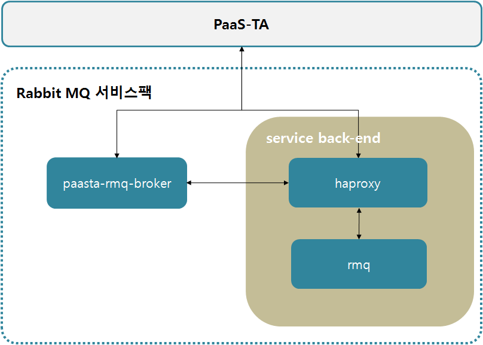
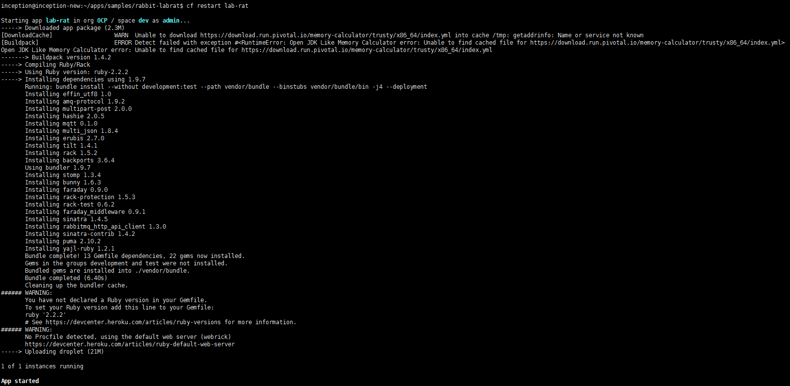
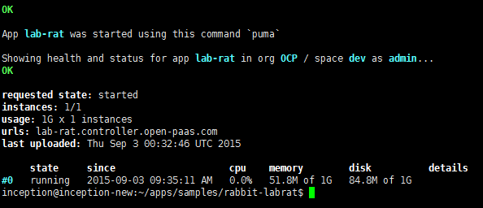
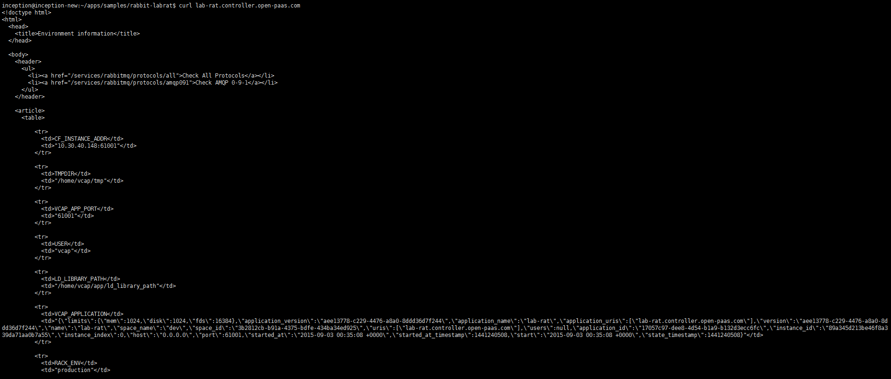
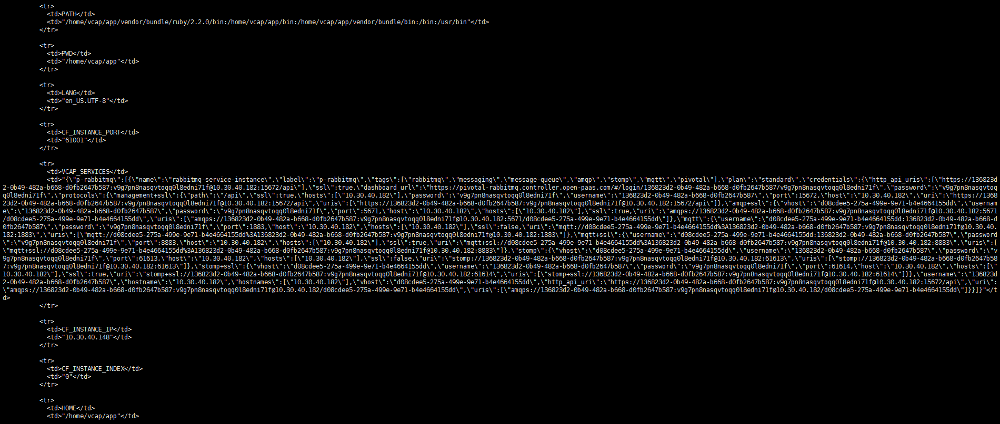
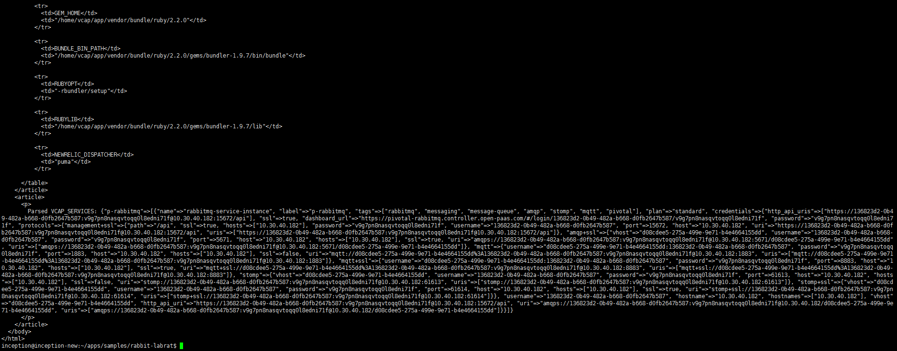

# PaaS-TA RabbitMQ 서비스팩 설치 가이드

### Table of Contents

1. [문서 개요](paas-ta-rabbitmq.md#1)
   * [1.1. 목적](paas-ta-rabbitmq.md#2)
   * [1.2. 범위](paas-ta-rabbitmq.md#3)
   * [1.3. 시스템 구성도](paas-ta-rabbitmq.md#4)
   * [1.4. 참고자료](paas-ta-rabbitmq.md#5)
2. [RabbitMQ 서비스팩 설치](paas-ta-rabbitmq.md#6)
   * [2.1. 설치전 준비사항](paas-ta-rabbitmq.md#7)
   * [2.2. RabbitMQ 서비스 릴리즈 업로드](paas-ta-rabbitmq.md#8)
   * [2.3. RabbitMQ 서비스 Deployment 파일 수정 및 배포](paas-ta-rabbitmq.md#9)
   * [2.4. RabbitMQ 서비스 브로커 등록](paas-ta-rabbitmq.md#10)
3. [RabbitMQ 연동 Sample App 설명](paas-ta-rabbitmq.md#11)
   * [3.1. Sample App 구조](paas-ta-rabbitmq.md#12)
   * [3.2. PaaS-TA에서 서비스 신청](paas-ta-rabbitmq.md#13)
   * [3.3. Sample App에 서비스 바인드 신청 및 App 확인](paas-ta-rabbitmq.md#14)


# 1. 문서 개요


#### 1.1. 목적

본 문서\(RabbitMQ서비스팩 설치 가이드\)는 전자정부표준프레임워크 기반의 PaaS-TA에서 제공되는 서비스팩인 RabbitMQ 서비스팩을 Bosh를 이용하여 설치 하는 방법과 PaaS-TA의 SaaS 형태로 제공하는 Application에서 RabbitMQ 서비스를 사용하는 방법을 기술하였다.


### 1.2. 범위 설치 범위

RabbitMQ 서비스팩을 검증하기 위한 기본 설치를 기준으로 작성하였다.


#### 1.3. 시스템 구성도

본 문서의 설치된 시스템 구성도이다. RabbitMQ\(1대\), RabbitMQ 서비스 브로커, haproxy로 최소사항을 구성하였다.



| 구분 | 스펙 |
| :--- | :--- |
| paasta-rmq-broker | 1vCPU / 1GB RAM / 8GB Disk |
| haproxy | 1vCPU / 1GB RAM / 8GB Disk |
| rmq | 1vCPU / 1GB RAM / 8GB Disk |


#### 1.4. 참고자료

- [**http://bosh.io/docs**](http://bosh.io/docs)
- [**http://docs.cloudfoundry.org/**](http://docs.cloudfoundry.org/)

## 2. RabbitMQ 서비스팩 설치

#### 2.1. 설치전 준비사항

본 설치 가이드는 Linux 환경에서 설치하는 것을 기준으로 하였다. 서비스팩 설치를 위해서는 먼저 BOSH CLI가 설치 되어 있어야 하고 BOSH 에 로그인 및 target 설정이 되어 있어야 한다. BOSH CLI가 설치 되어 있지 않을 경우 먼저 BOSH 설치 가이드 문서를 참고 하여 BOSH CLI를 설치 해야 한다.

* 다운로드 위치

  > PaaSTA-Services : [https://paas-ta.kr/data/packages/2.0/PaaSTA-Services.zip](https://paas-ta.kr/data/packages/2.0/PaaSTA-Services.zip)

  > PaaSTA-Deployment : [https://paas-ta.kr/data/packages/2.0/PaaSTA-Deployment.zip](https://paas-ta.kr/data/packages/2.0/PaaSTA-Deployment.zip)

  > PaaSTA-Sample-Apps : [https://paas-ta.kr/data/packages/2.0/PaaSTA-Sample-Apps.zip](https://paas-ta.kr/data/packages/2.0/PaaSTA-Sample-Apps.zip)


#### 2.2. RabbitMQ 서비스 릴리즈 업로드

* PaaSTA-Services.zip 파일 압축을 풀고 폴더안에 있는 RabbitMQ 서비스 릴리즈 paasta-rabbitmq-2.0.tgz 파일을 확인한다.

  ```text
  $ ls --all

  .  cf236      paasta-cubrid-2.0.tgz    paasta-mysql-2.0.tgz    paasta-portal-object-storage-2.0.tgz paasta-redis-2.0.tgz
  .. cf-release paasta-glusterfs-2.0.tgz paasta-pinpoint-2.0.tgz paasta-rabbitmq-2.0.tgz              paasta-web-ide-2.0.tgz
  ```

* 업로드 되어 있는 릴리즈 목록을 확인한다.

  ```text
$ bosh releases

RSA 1024 bit CA certificates are loaded due to old openssl compatibility
  Acting as user 'admin' on 'my-bosh'
+-----------------+----------+-------------+ | Name | Versions | Commit Hash | +-----------------+----------+-------------+ | empty-release | 2.0 | 870201f29+ | +-----------------+----------+-------------+ (+) Uncommitted changes

Ralease total 1
  ```

* RabbitMQ 서비스 릴리즈가 업로드 되어 있지 않은 것을 확인

* RabbitMQ 서비스 릴리즈 파일을 업로드한다.

```text
$ bosh upload release paasta-rabbitmq-2.0.tgz

RSA 1024 bit CA certificates are loaded due to old openssl compatibility Acting as user 'admin' on 'my-bosh'

Verifying manifest... Extract manifest OK Manifest exists OK Release name/version OK

File exists and readable OK Read package 'cf-cli' \(1 of 12\) OK Package 'cf-cli' checksum OK Read package 'cf-rabbitmq-smoke-tests' \(2 of 12\) OK Package 'cf-rabbitmq-smoke-tests' checksum OK Read package 'erlang' \(3 of 12\) OK Package 'erlang' checksum OK Read package 'golang-1.6.1' \(4 of 12\) OK Package 'golang-1.6.1' checksum OK Read package 'haproxy' \(5 of 12\) OK Package 'haproxy' checksum OK Read package 'java' \(6 of 12\) OK Package 'java' checksum OK Read package 'rabbitmq-broker' \(7 of 12\) OK Package 'rabbitmq-broker' checksum OK Read package 'rabbitmq-cluster-migration-tool' \(8 of 12\) OK Package 'rabbitmq-cluster-migration-tool' checksum OK Read package 'rabbitmq-common' \(9 of 12\) OK Package 'rabbitmq-common' checksum OK Read package 'rabbitmq-server' \(10 of 12\) OK Package 'rabbitmq-server' checksum OK Read package 'rabbitmq-syslog-aggregator' \(11 of 12\) OK Package 'rabbitmq-syslog-aggregator' checksum OK Read package 'rabbitmq-upgrade-preparation' \(12 of 12\) OK Package 'rabbitmq-upgrade-preparation' checksum OK Package dependencies OK Checking jobs format OK Read job 'broker-deregistrar' \(1 of 6\), version 57c1e5bf6e59618fa4c5d13efd7f8420cabeba2a OK Job 'broker-deregistrar' checksum OK Extract job 'broker-deregistrar' OK Read job 'broker-deregistrar' manifest OK Check template 'errand.sh.erb' for 'broker-deregistrar' OK Job 'broker-deregistrar' needs 'cf-cli' package OK Monit file for 'broker-deregistrar' OK Read job 'broker-registrar' \(2 of 6\), version e354968e46093de4e61d825a875bb33bffef79e3 OK Job 'broker-registrar' checksum OK Extract job 'broker-registrar' OK Read job 'broker-registrar' manifest OK Check template 'errand.sh.erb' for 'broker-registrar' OK Job 'broker-registrar' needs 'cf-cli' package OK Monit file for 'broker-registrar' OK Read job 'rabbitmq-broker' \(3 of 6\), version 4d344fde68bcf2712b60c3369137a970d2c6116c OK Job 'rabbitmq-broker' checksum OK Extract job 'rabbitmq-broker' OK Read job 'rabbitmq-broker' manifest OK Check template 'broker\_config.yml.erb' for 'rabbitmq-broker' OK Check template 'broker\_ctl.erb' for 'rabbitmq-broker' OK Check template 'pre-start.erb' for 'rabbitmq-broker' OK Check template 'syslog\_forwarder.conf.erb' for 'rabbitmq-broker' OK Check template 'broker\_syslog.conf.erb' for 'rabbitmq-broker' OK Job 'rabbitmq-broker' needs 'java' package OK Job 'rabbitmq-broker' needs 'rabbitmq-common' package OK Job 'rabbitmq-broker' needs 'rabbitmq-broker' package OK Job 'rabbitmq-broker' needs 'rabbitmq-syslog-aggregator' package OK Monit file for 'rabbitmq-broker' OK Read job 'rabbitmq-haproxy' \(4 of 6\), version a7c6a8a87a15f3fb40382a282d6075a4baf0f24f OK Job 'rabbitmq-haproxy' checksum OK Extract job 'rabbitmq-haproxy' OK Read job 'rabbitmq-haproxy' manifest OK Check template 'rabbitmq-haproxy.init.erb' for 'rabbitmq-haproxy' OK Check template 'haproxy.config.erb' for 'rabbitmq-haproxy' OK Check template 'pre-start.erb' for 'rabbitmq-haproxy' OK Check template 'syslog\_forwarder.conf.erb' for 'rabbitmq-haproxy' OK Check template 'haproxy\_syslog.conf.erb' for 'rabbitmq-haproxy' OK Job 'rabbitmq-haproxy' needs 'haproxy' package OK Job 'rabbitmq-haproxy' needs 'rabbitmq-syslog-aggregator' package OK Monit file for 'rabbitmq-haproxy' OK Read job 'rabbitmq-server' \(5 of 6\), version b7871ae1cce45589a135f6bab459d2a5c4dd3bc9 OK Job 'rabbitmq-server' checksum OK Extract job 'rabbitmq-server' OK Read job 'rabbitmq-server' manifest OK Check template 'plugins.sh.erb' for 'rabbitmq-server' OK Check template 'rabbitmq-server.init.erb' for 'rabbitmq-server' OK Check template 'setup.sh.erb' for 'rabbitmq-server' OK Check template 'node\_name\_migration.sh' for 'rabbitmq-server' OK Check template 'rabbitmq.config.erb' for 'rabbitmq-server' OK Check template 'cacert.pem.erb' for 'rabbitmq-server' OK Check template 'cert.pem.erb' for 'rabbitmq-server' OK Check template 'key.pem.erb' for 'rabbitmq-server' OK Check template 'users.erb' for 'rabbitmq-server' OK Check template 'pre-start.erb' for 'rabbitmq-server' OK Check template 'post-deploy.bash' for 'rabbitmq-server' OK Check template 'node-check.bash' for 'rabbitmq-server' OK Check template 'cluster-check.bash' for 'rabbitmq-server' OK Check template 'add-rabbitmqctl-to-path.bash' for 'rabbitmq-server' OK Check template 'syslog\_forwarder.conf.erb' for 'rabbitmq-server' OK Check template 'rabbitmq\_syslog.conf.erb' for 'rabbitmq-server' OK Check template 'delete\_old\_files.bash' for 'rabbitmq-server' OK Check template 'cleanup-http-logs.bash' for 'rabbitmq-server' OK Job 'rabbitmq-server' needs 'erlang' package OK Job 'rabbitmq-server' needs 'rabbitmq-server' package OK Job 'rabbitmq-server' needs 'rabbitmq-cluster-migration-tool' package OK Job 'rabbitmq-server' needs 'rabbitmq-upgrade-preparation' package OK Job 'rabbitmq-server' needs 'rabbitmq-syslog-aggregator' package OK Monit file for 'rabbitmq-server' OK Read job 'smoke-tests' \(6 of 6\), version a9230370cc5954574231962a0f7e2233daabf1e4 OK Job 'smoke-tests' checksum OK Extract job 'smoke-tests' OK Read job 'smoke-tests' manifest OK Check template 'config.json.erb' for 'smoke-tests' OK Check template 'errand.sh.erb' for 'smoke-tests' OK Job 'smoke-tests' needs 'golang-1.6.1' package OK Job 'smoke-tests' needs 'cf-rabbitmq-smoke-tests' package OK Job 'smoke-tests' needs 'cf-cli' package OK Monit file for 'smoke-tests' OK

### Release info

Name: paasta-rabbitmq Version: 2.0

Packages

* cf-cli \(68cbd378bc91c97fd0847075d71528c3eb1f7928\)
* cf-rabbitmq-smoke-tests \(b674b591adfffa72e6ddbe9eaa202f3dfae45b80\)
* erlang \(d689b1d899513421b211ded55d614407a1b51ad6\)
* golang-1.6.1 \(7c83e83f822259c6324742e3dfc5d4aaae25e9e6\)
* haproxy \(f0f2335dc5e7cab5c8a7232fd4aa9d92cbc8dba8\)
* java \(4cc1119c49707a07d69b3863914b6f1307e611b5\)
* rabbitmq-broker \(66260363d9b0ee0c671adc4a9b5e38453652fc06\)
* rabbitmq-cluster-migration-tool \(aa2db9b54d0d87e67b4b7ef7ae1854ebe6cef867\)
* rabbitmq-common \(a1ceb4166602035b5e8783f2d90a2048a654875f\)
* rabbitmq-server \(c93764197128c6e731899062f1cc33aef9cef053\)
* rabbitmq-syslog-aggregator \(a1662acacf8b2ef2ff54707681b125370544c824\)
* rabbitmq-upgrade-preparation \(3ef7571fb3896b0c2260fd8063e47dfd4802a81c\)

Jobs

* broker-deregistrar \(57c1e5bf6e59618fa4c5d13efd7f8420cabeba2a\)
* broker-registrar \(e354968e46093de4e61d825a875bb33bffef79e3\)
* rabbitmq-broker \(4d344fde68bcf2712b60c3369137a970d2c6116c\)
* rabbitmq-haproxy \(a7c6a8a87a15f3fb40382a282d6075a4baf0f24f\)
* rabbitmq-server \(b7871ae1cce45589a135f6bab459d2a5c4dd3bc9\)
* smoke-tests \(a9230370cc5954574231962a0f7e2233daabf1e4\)

License

* license \(c3a4ca7589687d67435c0c8061b5052f8e5e8103\)

Checking if can repack release for faster upload... cf-cli \(68cbd378bc91c97fd0847075d71528c3eb1f7928\) UPLOAD cf-rabbitmq-smoke-tests \(b674b591adfffa72e6ddbe9eaa202f3dfae45b80\) UPLOAD erlang \(d689b1d899513421b211ded55d614407a1b51ad6\) UPLOAD golang-1.6.1 \(7c83e83f822259c6324742e3dfc5d4aaae25e9e6\) UPLOAD haproxy \(f0f2335dc5e7cab5c8a7232fd4aa9d92cbc8dba8\) UPLOAD java \(4cc1119c49707a07d69b3863914b6f1307e611b5\) UPLOAD rabbitmq-broker \(66260363d9b0ee0c671adc4a9b5e38453652fc06\) UPLOAD rabbitmq-cluster-migration-tool \(aa2db9b54d0d87e67b4b7ef7ae1854ebe6cef867\) UPLOAD rabbitmq-common \(a1ceb4166602035b5e8783f2d90a2048a654875f\) UPLOAD rabbitmq-server \(c93764197128c6e731899062f1cc33aef9cef053\) UPLOAD rabbitmq-syslog-aggregator \(a1662acacf8b2ef2ff54707681b125370544c824\) UPLOAD rabbitmq-upgrade-preparation \(3ef7571fb3896b0c2260fd8063e47dfd4802a81c\) UPLOAD broker-deregistrar \(57c1e5bf6e59618fa4c5d13efd7f8420cabeba2a\) UPLOAD broker-registrar \(e354968e46093de4e61d825a875bb33bffef79e3\) UPLOAD rabbitmq-broker \(4d344fde68bcf2712b60c3369137a970d2c6116c\) UPLOAD rabbitmq-haproxy \(a7c6a8a87a15f3fb40382a282d6075a4baf0f24f\) UPLOAD rabbitmq-server \(b7871ae1cce45589a135f6bab459d2a5c4dd3bc9\) UPLOAD smoke-tests \(a9230370cc5954574231962a0f7e2233daabf1e4\) UPLOAD Uploading the whole release

Uploading release paasta-rabbit: 96% \|oooooooooooooooooooooooooooooooooooooooooooooooooooooooooooooooooooooooooo \| 276.1MB 34.7MB/s ETA: 00:00:00 Director task Started extracting release &gt; Extracting release. Done \(00:00:02\)

Started verifying manifest &gt; Verifying manifest. Done \(00:00:00\)

Started resolving package dependencies &gt; Resolving package dependencies. Done \(00:00:00\)

Started creating new packages Started creating new packages &gt; cf-cli/68cbd378bc91c97fd0847075d71528c3eb1f7928. Done \(00:00:00\) Started creating new packages &gt; cf-rabbitmq-smoke-tests/b674b591adfffa72e6ddbe9eaa202f3dfae45b80. Done \(00:00:01\) Started creating new packages &gt; erlang/d689b1d899513421b211ded55d614407a1b51ad6. Done \(00:00:00\) Started creating new packages &gt; golang-1.6.1/7c83e83f822259c6324742e3dfc5d4aaae25e9e6. Done \(00:00:02\) Started creating new packages &gt; haproxy/f0f2335dc5e7cab5c8a7232fd4aa9d92cbc8dba8. Done \(00:00:00\) Started creating new packages &gt; java/4cc1119c49707a07d69b3863914b6f1307e611b5. Done \(00:00:00\) Started creating new packages &gt; rabbitmq-broker/66260363d9b0ee0c671adc4a9b5e38453652fc06. Done \(00:00:01\) Started creating new packages &gt; rabbitmq-cluster-migration-tool/aa2db9b54d0d87e67b4b7ef7ae1854ebe6cef867. Done \(00:00:00\) Started creating new packages &gt; rabbitmq-common/a1ceb4166602035b5e8783f2d90a2048a654875f. Done \(00:00:00\) Started creating new packages &gt; rabbitmq-server/c93764197128c6e731899062f1cc33aef9cef053. Done \(00:00:00\) Started creating new packages &gt; rabbitmq-syslog-aggregator/a1662acacf8b2ef2ff54707681b125370544c824. Done \(00:00:00\) Started creating new packages &gt; rabbitmq-upgrade-preparation/3ef7571fb3896b0c2260fd8063e47dfd4802a81c. Done \(00:00:00\) Done creating new packages \(00:00:04\)

Started creating new jobs Started creating new jobs &gt; broker-deregistrar/57c1e5bf6e59618fa4c5d13efd7f8420cabeba2a. Done \(00:00:00\) Started creating new jobs &gt; broker-registrar/e354968e46093de4e61d825a875bb33bffef79e3. Done \(00:00:00\) Started creating new jobs &gt; rabbitmq-broker/4d344fde68bcf2712b60c3369137a970d2c6116c. Done \(00:00:00\) Started creating new jobs &gt; rabbitmq-haproxy/a7c6a8a87a15f3fb40382a282d6075a4baf0f24f. Done \(00:00:00\) Started creating new jobs &gt; rabbitmq-server/b7871ae1cce45589a135f6bab459d2a5c4dd3bc9. Done \(00:00:00\) Started creating new jobs &gt; smoke-tests/a9230370cc5954574231962a0f7e2233daabf1e4. Done \(00:00:00\) Done creating new jobs \(00:00:00\)

Started release has been created &gt; paasta-rabbitmq/2.0. Done \(00:00:00\)

Task 372 done

Started 2017-01-16 05:28:49 UTC Finished 2017-01-16 05:28:55 UTC Duration :00:06 paasta-rabbit: 96% \|oooooooooooooooooooooooooooooooooooooooooooooooooooooooooooooooooooooooooooooooooooooooooooooooooooooo \| 276.8MB 17.0MB/s Time: 00:00:16

Release upload
```

* 업로드된 RabbitMQ 릴리즈를 확인한다.

```text
$ bosh releases

RSA 1024 bit CA certificates are loaded due to old openssl compatibility Acting as user 'admin' on 'my-bosh'

+-----------------+----------+-------------+ \| Name \| Versions \| Commit Hash \| +-----------------+----------+-------------+ \| paasta-rabbitmq \| 2.0 \| 21516d49+ \| +-----------------+----------+-------------+ \(+\) Uncommitted changes

Release Total : 1
```


#### 2.3. RabbitMQ 서비스 Deployment 파일 수정 및 배포
BOSH Deployment manifest 는 components 요소 및 배포의 속성을 정의한 YAML  파일이다.
Deployment manifest 에는 sotfware를 설치 하기 위해서 어떤 Stemcell (OS, BOSH agent)을 사용 할 것인지와 Release (Software packages, Config templates, Scripts)의 이름과 버전, VMs 용량, Jobs params 등;이 정의 되어 있다.

* PaaSTA-Deployment.zip 파일 압축을 풀고 폴더안에 있는 IaaS별 rabbitmq Deployment 파일을 복사한다.
예) vsphere 일 경우 paasta_rabbitmq_image_2.0.yml를 복사
다운로드 받은 Deployment Yml 파일을 확인한다.

```text
$ls –all

. openpaas-mysql-aws-1.0.yml paasta\_mysql\_aws\_2.0.yml paasta\_portal\_object\_storage\_vsphere\_2.0.yml paasta\_web\_ide\_aws\_2.0.yml .. paasta\_cubrid\_vsphere\_2.0.yml paasta\_pinpoint\_cluster\_aws\_2.0.yml paasta\_rabbitmq\_vsphere\_2.0.yml cf236 paasta-glusterfs-vsphere-2.0.yml paasta\_pinpoint\_vsphere\_2.0.yml paasta\_redis\_vsphere\_2.0.yml
```

* Director UUID를 확인한다.
BOSH CLI가 배포에 대한 모든 작업을 허용하기 위한 현재 대상 BOSH Director의 UUID와 일치해야 한다. ‘bosh status’ CLI 을 통해서 현재 BOSH Director 에 target 되어 있는 UUID를 확인할 수 있다.

```text
$ bosh status

Config /home/inception/.bosh\_config

Director RSA 1024 bit CA certificates are loaded due to old openssl compatibility Name bosh URL [https://10.30.40.105:25555](https://10.30.40.105:25555) Version .1.0 \(00000000\) User admin UUID d363905f-eaa0-4539-a461-8c1318498a32 CPI vsphere\_cpi dns disabled compiled\_package\_cache disabled snapshots disabled

Deployment Manifest /home/inception/crossent-deploy/paasta-logsearch.yml
```

* Deploy시 사용할 Stemcell을 확인한다.

```text
$ bosh stemcells

RSA 1024 bit CA certificates are loaded due to old openssl compatibility Acting as user 'admin' on 'bosh'

+------------------------------------------+---------------+---------+-----------------------------------------+ \| Name \| OS \| Version \| CID \| +------------------------------------------+---------------+---------+-----------------------------------------+ \| bosh-vsphere-esxi-ubuntu-trusty-go\_agent \| ubuntu-trusty \| 3263.8 _\| sc-af443b65-9335-43b1-9b64-6d1791a10428 \| \| bosh-vsphere-esxi-ubuntu-trusty-go\_agent \| ubuntu-trusty \| 3309_ \| sc-e00c788b-ac6b-4089-bc43-f56a3ffdb55a \| +------------------------------------------+---------------+---------+-----------------------------------------+

\(\*\) Currently in-use

Stemcells total: 2
```

Stemcell 목록이 존재 하지 않을 경우 BOSH 설치 가이드 문서를 참고 하여 Stemcell을 업로드 해야 한다.

* Deployment 파일을 서버 환경에 맞게 수정한다. (vsphere 용으로 설명, 다른 IaaS는 해당 Deployment 파일의 주석내용을 참고)

```text
name: paasta-rabbitmq-service                          # 서비스 배포이름(필수)
director_uuid: d363905f-eaa0-4539-a461-8c1318498a32    # bosh status 에서 확인한 Director UUID을 입력(필수)

releases:
- name: paasta-rabbitmq                                # 서비스 릴리즈 이름(필수)
  version: 2.0                                         # 서비스 릴리즈 버전(필수): latest 시 업로드된 서비스 릴리즈 최신버전

update:
  canaries: 1                                          # canary 인스턴스 수(필수)
  canary_watch_time: 30000-180000                      # canary 인스턴스가 수행하기 위한 대기 시간(필수)
  max_in_flight: 6                                     # non-canary 인스턴스가 병렬로 update 하는 최대 개수(필수)
  update_watch_time: 30000-180000                      # non-canary 인스턴스가 수행하기 위한 대기 시간(필수)


compilation:                   # 컴파일시 필요한 가상머신의 속성(필수)
  cloud_properties:            # 컴파일 VM을 만드는 데 필요한 IaaS의 특정 속성 (instance_type, availability_zone), 직접 cpu,disk,ram 사이즈를 넣어도 됨
    cpu: 2
    disk: 4096
    ram: 4096
  network: default                       # Networks block에서 선언한 network 이름(필수)
  reuse_compilation_vms: true            # 컴파일지 VM 재사용 여부(옵션)
  workers: 6                             # 컴파일 하는 가상머신의 최대수(필수)

jobs:
- instances: 1                           # job 인스턴스 수(필수)
  name: rmq                              # 작업 이름(필수): rabbitmq 서버
  networks:                              # 네트워크 구성정보
  - name: default                        # Networks block에서 선언한 network 이름(필수)
    static_ips:
    - 10.30.40.83                        # 사용할 IP addresses 정의(필수): rabbitmq-server IP
#    - 10.30.40.84
#  persistent_disk: 2048                 # 영구적 디스크 사이즈 정의(옵션)
  resource_pool: services-small          # Resource Pools block에 정의한 resource pool 이름(필수)
  templates:
  - name: rabbitmq-server                # job template 이름(필수)
    release: paasta-rabbitmq             # 릴리즈 이름(필수)
  syslog_aggregator: null
- instances: 1
  name: haproxy                          # 작업 이름(필수):  rabbit mq haproxy
  networks:
  - name: default
    static_ips:
    - 10.30.40.82                        # 사용할 IP addresses 정의(필수):  rabbit mq haproxy
#  persistent_disk: 256
  resource_pool: services-small
  templates:
  - name: rabbitmq-haproxy
    release: paasta-rabbitmq
  syslog_aggregator: null
- instances: 1
  name: paasta-rmq-broker                # 작업 이름(필수): rabbit mq broker
  networks:
  - name: default
    static_ips:
    - 10.30.40.81                        # 사용할 IP addresses 정의(필수): rabbit mq broker
#  persistent_disk: 512
  resource_pool: services-small
  templates:
  - name: rabbitmq-broker
    release: paasta-rabbitmq
  syslog_aggregator: null
- instances: 1
  lifecycle: errand                      # bosh deploy시 vm에 생성되어 설치 되지 않고 bosh errand 로 실행할때 설정, 주로 테스트 용도에 쓰임
  name: broker-registrar
  networks:
  - name: default
  properties:
    broker:
      host: 10.30.40.81
      name: rabbitmq-sb
      password: admin
      username: admin
      protocol: http
      port: 4567
  resource_pool: services-small
  templates:
  - name: broker-registrar
    release: paasta-rabbitmq
- instances: 1
  lifecycle: errand
  name: broker-deregistrar
  networks:
  - name: default
  properties:
    broker:
      host: 10.30.40.81
      name: rabbitmq-sb
      password: admin
      username: admin
      protocol: http
      port: 4567
  resource_pool: services-small
  templates:
  - name: broker-deregistrar
    release: paasta-rabbitmq

networks:                              # 네트워크 블록에 나열된 각 서브 블록이 참조 할 수있는 작업이 네트워크 구성을 지정, 네트워크 구성은 네트워크 담당자에게 문의 하여 작성 요망
- name: default
  subnets:
  - cloud_properties:
      name: Internal                   # vsphere 에서 사용하는 network 이름(필수)
    dns:                               # DNS 정보
    - 8.8.8.8
    gateway: 10.30.20.23
    name: default_unused
    range: 10.30.0.0/16
    reserved:                          # 설치시 제외할 IP 설정
    - 10.30.0.1 - 10.30.10.254
    - 10.30.40.1 - 10.30.40.80
    - 10.30.40.201 - 10.30.254.254
    static:
#    - 10.30.40.81 - 10.30.40.84
    - 10.30.40.81 - 10.30.40.83        # 사용 가능한 IP 설정
properties:
  cf:                                          # CF 환경 정보
    admin_password: admin                      # CF 어드민 아이디 비밀번호(필수)
    admin_username: admin                      # CF 어드민 아이디 (필수)
    api_url: http://api.115.68.46.186.xip.io    # CF API url(필수)
    domain: 115.68.46.186.xip.io                # CF 도메인(필수)
  rabbitmq-server:
    restart_statsdb_cron_schedule: "42 */4 * * *"
    plugins:                                  # rabbitmq 플러그인 정보(필수)
    - rabbitmq_management
    - rabbitmq_mqtt
    - rabbitmq_stomp
    ports:                                    # rabbitmq haproxy 에서 허용하는 포트 목록(필수)
    - 5672
    - 5671
    - 1883
    - 8883
    - 61613
    - 61614
    - 15672
    - 15674
    administrators:
      management:                            # rabbitmq management 사용자 및 패스워드 정보
        username: admin
        password: admin
      broker:                                # rabbitmq service broker 아이디 및 패스워드 정보
        username: admin
        password: admin
  rabbitmq-haproxy:                          # rabbitmq service broker 아이디 및 패스워드 정보
    stats:
      username: admin
      password: admin
  broker:                                    # rabbitmq service broker 아이디 및 패스워드 정보
    host: 10.30.40.81
    protocol: http
    name: p-rabbitmq
    username: "admin"
    password: "admin"
  rabbitmq-broker:
    route: paasta-rabbitmq-broker
    cc_endpoint: http://api.115.68.46.186.xip.io
    service:                                 # 서비스 이름및 uuid 플랜 Id 정보
      username: "admin"
      password: "admin"
      name: p-rabbitmq
      uuid: 163b47c6-a2f3-43b1-97f7-b83b37ecabcd
      plan_uuid: 4e816145-4e71-4e24-a402-0c686b868e2d
    logging:
      level: debug
      print_stack_traces: false
    rabbitmq:
      operator_set_policy:
        enabled: true
        policy_name: "operator_set_policy"
        policy_definition: "{\"ha-mode\":\"exactly\",\"ha-params\":2,\"ha-sync-mode\":\"automatic\"}"
        policy_priority: 50
      management_domain: 115.68.46.186.xip.io
      ssl: |
        -----BEGIN CERTIFICATE-----
        MIIC+zCCAeOgAwIBAgIBAjANBgkqhkiG9w0BAQUFADAnMRUwEwYDVQQDEwxNeVRl
        c3RSb290Q0ExDjAMBgNVBAcTBTY0MTAzMB4XDTE0MDkwNDA3MjIwOFoXDTI0MDkw
        MTA3MjIwOFowKjEXMBUGA1UEAxMObWVyY3VyaW8ubG9jYWwxDzANBgNVBAoTBnNl
        cnZlcjCCASIwDQYJKoZIhvcNAQEBBQADggEPADCCAQoCggEBANxxSzf958VIm8lp
        qQ4BHSmz1z8yU/KEKSbuEfIqpGwpVx6TZ+ZYiXa0cMV2pE7UKR4OyJiuvtvv9kzu
        6g+HTXmJo2cqVonGCAMp6d9TkCAMaMF76IrbLyGmvXQDcjOmWarvsGHW/w6gJpw9
        svDP9EXyXTBUfaJq3T8+9UQBfMsL4dHwAt79YgvSQLsYiIi2rzQixK/4PHFeHf3G
        I/UDgjG0YG9iCWp2g1Sc3Z6hYB/0pOCBxE7LCrSGS6/M/7c2569yK7NqSSNN7Lqz
        ZoQSF1NYE6KRd2MK2A0QaKrn9v8K5/Lp0fk70bvwtLxTWtp3wq3bYQg8UdqY/6R8
        UATS/aMCAwEAAaMvMC0wCQYDVR0TBAIwADALBgNVHQ8EBAMCBSAwEwYDVR0lBAww
        CgYIKwYBBQUHAwEwDQYJKoZIhvcNAQEFBQADggEBAHC89mK1HJgDqwxjsGpa3V7t
        Nuqe/XxEIUUN3Lm4gBLKq4wed4c6z4csv16f3uL9cypyHPSrQmMPV7CDgWLX4F7g
        YN9PGaVfIp/rGNsDWJEVNU2rfIEDIUfcL+o844jE8CtmzZ4bGVrCHqKW5pAraai1
        o5h3JaU4yDLo49rqPeRft2n/gj+5E3gi/1TsnuLuzB7kK1gaTTOrV3GASiGokCEN
        4v1ZjaqMSGMcwA/esaLv2N6UYJgd5lyJ7PEL4ddE8QCTo2EPhYyltLxRqOjrxa+5
        KONA94PDj14gOSSsoXkoj7gWQsuHT2RXmurYXk4/PkS+k1j0+ZCzKi/ZxF5jt50=
        -----END CERTIFICATE-----
      administrator:
        username: admin
        password: admin

resource_pools:                          # 배포시 사용하는 resource pools를 명시하며 여러 개의 resource pools 을 사용할 경우 name 은 unique 해야함(필수)
- cloud_properties:                      # 컴파일 VM을 만드는 데 필요한 IaaS의 특정 속성을 설명 (instance_type, availability_zone), 직접 cpu, disk, 메모리 설정가능
    cpu: 1
    disk: 8192
    ram: 1024
  name: services-small                  # 고유한 resource pool 이름
  network: default
  stemcell:
    name: bosh-vsphere-esxi-ubuntu-trusty-go_agent               # stemcell 이름(필수)
    version: "3309"                                            # stemcell 버전(필수)
```

* Deploy 할 deployment manifest 파일을 BOSH 에 지정한다.

  ```text
  $ bosh deployment paasta_rabbitmq_vsphere_2.0.yml

  RSA 1024 bit CA certificates are loaded due to old openssl compatibility
  Deployment set to '/mnt/workspace/deployments/test-deployments/paasta_rabbitmq_vsphere_2.0.yml'
  ```

* RabbitMQ 서비스팩을 배포한다.

  ```text
 $ bosh deploy

  RSA 1024 bit CA certificates are loaded due to old openssl compatibility
  Acting as user 'admin' on deployment 'paasta-rabbitmq-service' on 'my-bosh'
  Getting deployment properties from director...
  Unable to get properties list from director, trying without it...
```

### Detecting deployment changes

...&lt; manifest 파일 내용 출력// 생략 &gt;...

Please review all changes carefully

### Deploying

Are you sure you want to deploy? \(type 'yes' to continue\): yes

Director task Deprecation: Ignoring cloud config. Manifest contains 'networks' section.

Started preparing deployment &gt; Preparing deployment. Done \(00:00:00\)

Started preparing package compilation &gt; Finding packages to compile. Done \(00:00:00\)

Started compiling packages Started compiling packages &gt; cf-cli/68cbd378bc91c97fd0847075d71528c3eb1f7928 Started compiling packages &gt; rabbitmq-broker/66260363d9b0ee0c671adc4a9b5e38453652fc06 Done compiling packages &gt; cf-cli/68cbd378bc91c97fd0847075d71528c3eb1f7928\(00:01:28\) Started compiling packages &gt; rabbitmq-common/a1ceb4166602035b5e8783f2d90a2048a654875f Done compiling packages &gt; rabbitmq-broker/66260363d9b0ee0c671adc4a9b5e38453652fc06\(00:01:32\) Started compiling packages &gt; java/4cc1119c49707a07d69b3863914b6f1307e611b5 Done compiling packages &gt; rabbitmq-common/a1ceb4166602035b5e8783f2d90a2048a654875f\(00:00:08\) Started compiling packages &gt; haproxy/f0f2335dc5e7cab5c8a7232fd4aa9d92cbc8dba8 Done compiling packages &gt; java/4cc1119c49707a07d69b3863914b6f1307e611b5\(00:00:22\) Started compiling packages &gt; rabbitmq-syslog-aggregator/a1662acacf8b2ef2ff54707681b125370544c824. Done \(00:00:06\) Started compiling packages &gt; golang-1.6.1/7c83e83f822259c6324742e3dfc5d4aaae25e9e6 Done compiling packages &gt; haproxy/f0f2335dc5e7cab5c8a7232fd4aa9d92cbc8dba8\(00:00:38\) Started compiling packages &gt; rabbitmq-server/c93764197128c6e731899062f1cc33aef9cef053. Done \(00:00:06\) Started compiling packages &gt; erlang/d689b1d899513421b211ded55d614407a1b51ad6 Done compiling packages &gt; golang-1.6.1/7c83e83f822259c6324742e3dfc5d4aaae25e9e6\(00:00:25\) Started compiling packages &gt; rabbitmq-upgrade-preparation/3ef7571fb3896b0c2260fd8063e47dfd4802a81c. Done \(00:00:14\) Started compiling packages &gt; rabbitmq-cluster-migration-tool/aa2db9b54d0d87e67b4b7ef7ae1854ebe6cef867. Done \(00:00:12\) Done compiling packages &gt; erlang/d689b1d899513421b211ded55d614407a1b51ad6\(00:04:24\) Done compiling packages \(00:06:44\)

Started creating missing vms Started creating missing vms &gt; rmq/48e1fdae-965a-4750-a8bb-1811878a3d98 \(0\) Started creating missing vms &gt; haproxy/5de67578-1315-405d-9721-5e655b1a7954 \(0\) Started creating missing vms &gt; paasta-rmq-broker/18d4ae42-db87-400b-9d18-95c7a146acc9 \(0\). Done \(00:01:29\) Done creating missing vms &gt; rmq/48e1fdae-965a-4750-a8bb-1811878a3d98 \(0\)\(00:01:29\) Done creating missing vms &gt; haproxy/5de67578-1315-405d-9721-5e655b1a7954 \(0\)\(00:01:29\) Done creating missing vms \(00:01:29\)

Started updating instance haproxy&gt; haproxy/5de67578-1315-405d-9721-5e655b1a7954 \(0\) \(canary\) Started updating instance rmq&gt; rmq/48e1fdae-965a-4750-a8bb-1811878a3d98 \(0\) \(canary\) Started updating instance paasta-rmq-broker&gt; paasta-rmq-broker/18d4ae42-db87-400b-9d18-95c7a146acc9 \(0\) \(canary\) Done updating instance haproxy&gt; haproxy/5de67578-1315-405d-9721-5e655b1a7954 \(0\) \(canary\)\(00:00:47\) Done updating instance rmq&gt; rmq/48e1fdae-965a-4750-a8bb-1811878a3d98 \(0\) \(canary\)\(00:00:52\) Done updating instance paasta-rmq-broker&gt; paasta-rmq-broker/18d4ae42-db87-400b-9d18-95c7a146acc9 \(0\) \(canary\)\(00:00:55\)

Task 373 done

Started 2017-01-16 05:37:31 UTC Finished 2017-01-16 05:47:18 UTC Duration :09:47

Deployed 'paasta-rabbitmq-service' to 'my-bosh'


* 배포된 RabbitMQ 서비스팩을 확인한다.

```text
$ bosh vms

RSA 1024 bit CA certificates are loaded due to old openssl compatibility Acting as user 'admin' on deployment 'paasta-rabbitmq-service' on 'my-bosh'
Director task
Task 375 done

+------------------------------------------------------------+---------+-----+----------------+-----------+ \| VM \| State \| AZ \| VM Type \| IPs \| +------------------------------------------------------------+---------+-----+----------------+-----------+ \| haproxy/0 \(5de67578-1315-405d-9721-5e655b1a7954\) \| running \| n/a \| resource\_pools \| 10.0.0.82 \| \| paasta-rmq-broker/0 \(18d4ae42-db87-400b-9d18-95c7a146acc9\) \| running \| n/a \| resource\_pools \| 10.0.0.81 \| \| rmq/0 \(48e1fdae-965a-4750-a8bb-1811878a3d98\) \| running \| n/a \| resource\_pools \| 10.0.0.83 \| +------------------------------------------------------------+---------+-----+----------------+-----------+

VMs total: 3
```

###<div id='10'>2.4. RabbitMQ 서비스 브로커 등록
RabbitMQ 서비스팩 배포가 완료 되었으면 Application에서 서비스 팩을 사용하기 위해서 먼저 RabbitMQ 서비스 브로커를 등록해 주어야 한다.
서비스 브로커 등록시에는 PaaS-TA에서 서비스 브로커를 등록할 수 있는 사용자로 로그인 하여야 한다

* 서비스 브로커 목록을 확인한다.

```text
$ cf service-brokers
```


* rabbitmq 서비스 브로커를 등록한다.

cf create-service-broker {서비스브로커 이름} {서비스브로커 사용자ID} {서비스브로커 사용자비밀번호} [http://{서비스브로커](http://{서비스브로커) 호스트}:{서비스브로커 포트}

* 서비스브로커 이름 : 서비스 브로커 관리를 위해 PaaS-TA에서 보여지는 명칭이다. 서비스 Marketplace에서는 각각의 API 서비스 명이 보여지니 여기서 명칭은 서비스팩 리스트의 명칭이다.
* 서비스브로커 사용자ID / 비밀번호 : 서비스 브로커에 접근할 수 있는 사용자 ID이다. 서비스팩도 하나의 API 서버이기 때문에 아무나 접근을 허용할 수 없어 접근이 가능한 ID/비밀번호를 입력한다.
* 서비스브로커 URL : 서비스 브로커가 제공하는 API를 사용할 수 있는 URL을 입력한다.

  ```text
  $ cf create-service-broker rabbitmq-service-broker admin admin [http://10.30.40.81:4567](http://10.30.40.81:4567)
```

  

* 등록된 RabbitMQ 서비스 브로커를 확인한다.

```text
$ cf service-brokers
```


* 접근 가능한 서비스 목록을 확인한다.

```text
$ cf service-access
```

 

서비스 브로커 등록시 최초에는 접근을 허용하지 않는다. 따라서 access는 none으로 설정된다.

* 특정 조직에 해당 서비스 접근 허용을 할당하고 접근 서비스 목록을 다시 확인한다. \(전체 조직\)

```text
$ cf enable-service-access p-rabbitmq
$ cf service-access
```


## 3. RabbitMQ 연동 Sample App 설명

본 Sample App은 PaaS-TA에 배포되며 RabbitMQ의 서비스를 Provision과 Bind를 한 상태에서 사용이 가능하다.

#### 3.1. Sample App 구조

Sample App은 PaaS-TA에 App으로 배포가 된다. 배포 완료 후 정상적으로 App이 구동되면 curl 명령어로 App url를 입력하면 RabbitMQ 환경정보\(서비스 연결 정보\)를 보여주는 url 페이지를 제공한다.

Sample App 구조는 다음과 같다.

| 이름 | 설명 |
| :--- | :--- |
| lib | Sample 소스디렉토리 |
| manifest.yml | PaaS-TA에 app 배포시 필요한 설정을 저장하는 파일 |
| Gemfile | Sample App 구동시 필요한 ruby gem 설정 파일 |
| config.ru | Sample App 구동 파일 |

* PaaSTA-Sample-Apps.zip 파일 압축을 풀고 Service 폴더안에 있는 RabbitMQ Sample Web App인 rabbit-labrat을 복사한다.

> $ ls -all 


#### 3.2. PaaS-TA에서 서비스 신청

Sample App에서 RabbitMQ 서비스를 사용하기 위해서는 서비스 신청\(Provision\)을 해야 한다. \*참고: 서비스 신청시 PaaS-TA에서 서비스를 신청 할 수 있는 사용자로 로그인이 되어 있어야 한다.

* 먼저 PaaS-TA Marketplace에서 서비스가 있는지 확인을 한다.

> $ cf marketplace 


* Marketplace에서 원하는 서비스가 있으면 서비스 신청\(Provision\)을 한다.

```text
$ cf create-service {서비스명} {서비스 플랜} {내 서비스명}
- 서비스명 : p-rabbitmq로 Marketplace에서 보여지는 서비스 명칭이다.
- 서비스플랜 : 서비스에 대한 정책으로 plans에 있는 정보 중 하나를 선택한다. RabbitMQ 서비스는 standard plan만 지원한다.
- 내서비스명 : 내 서비스에서 보여지는 명칭이다. 이 명칭을 기준으로 환경 설정 정보를 가져온다.
```

> $ cf create-service p-rabbitmq standard rabbitmq-service-instance 


* 생성된 rabbitmq 서비스 인스턴스를 확인한다.

> $ cf services 


#### 3.3. Sample App에 서비스 바인드 신청 및 App 확인

서비스 신청이 완료되었으면 Sample App 에서는 생성된 서비스 인스턴스를 Bind 하여 App에서 RabbitMQ 서비스를 이용한다.

* 참고: 서비스 Bind 신청시 PaaS-TA에서 서비스 Bind 신청 할 수 있는 사용자로 로그인이 되어 있어야 한다.
* Sample App 디렉토리로 이동하여 manifest 파일을 확인한다

```text
$ cd rabbit-labrat
```

```text
$ vi manifest.yml
```

```yaml
---
applications:
- name: lab-rat         # 배포할 App 이름
command: puma           # 배포시 명령어
```

* --no-start 옵션으로 App을 배포한다.

  --no-start: App 배포시 구동은 하지 않는다.

> $ cf push --no-start
>  

* 배포된 Sample App을 확인하고 로그를 수행한다.

> $ cf apps
>  
>
> $ cf logs {배포된 App명} $ cf logs lab-rat 


* Sample App에서 생성한 서비스 인스턴스 바인드 신청을 한다.

> $ cf bind-service lab-rat rabbitmq-service-instance 


* 바인드가 적용되기 위해서 App을 재기동한다.

> $ cf restart lab-rat 
 


* App이 정상적으로 RabbitMQ 서비스를 사용하는지 확인한다.

> - curl 로 확인
>  $ curl lab-rat.115.68.46.186.xip.io
>
>
>    

