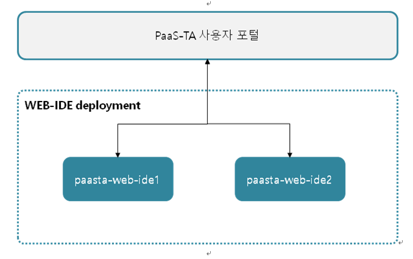
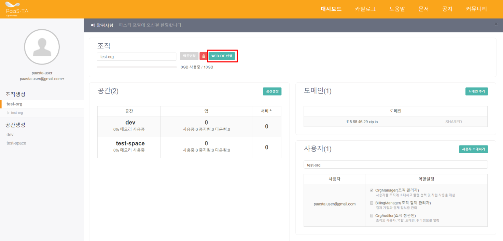
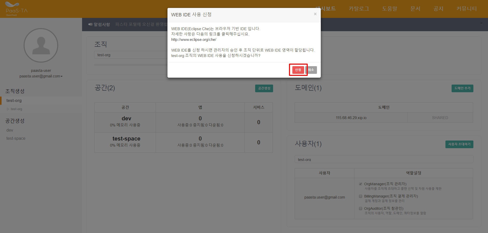
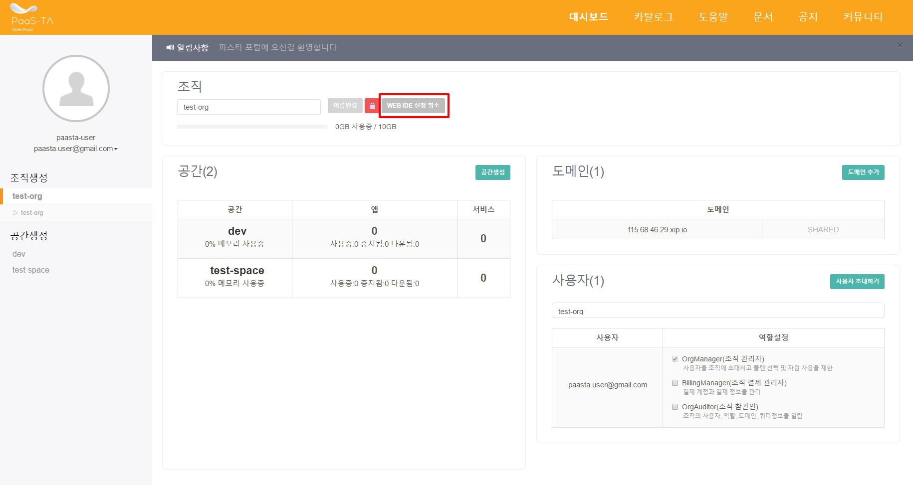
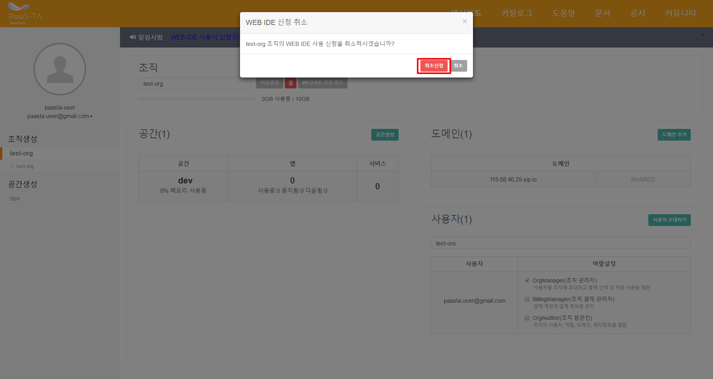
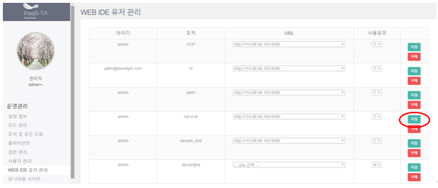
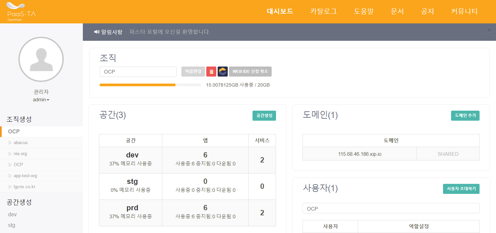
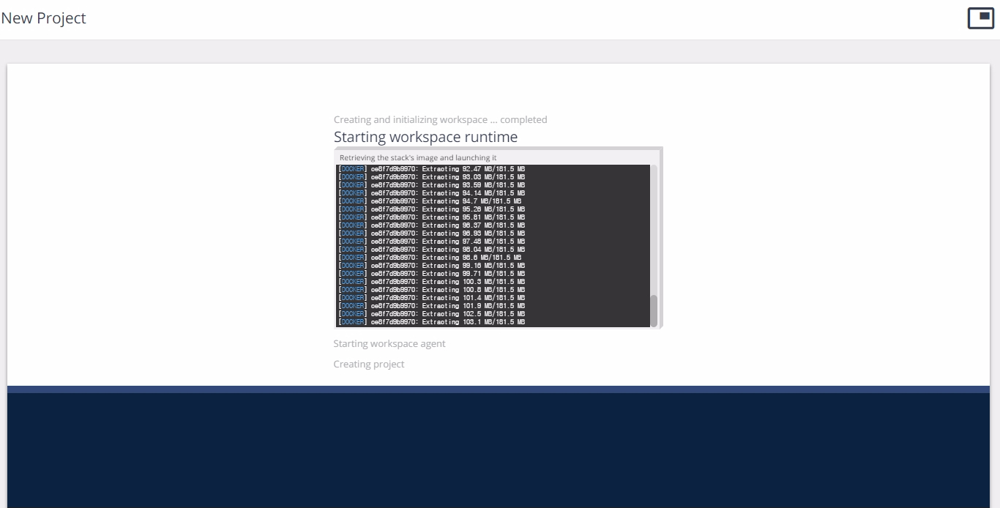
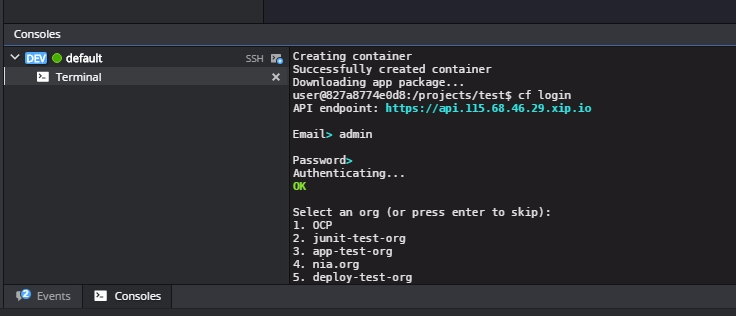

# Table of Contents

1. [문서 개요](paas-ta-web-ide.md#1)
   * 1.1. [목적](paas-ta-web-ide.md#2)
   * 1.2. [범위](paas-ta-web-ide.md#3)
   * 1.3. [시스템 구성도](paas-ta-web-ide.md#4)
   * 1.4. [참고자료](paas-ta-web-ide.md#5)
2. [WEB IDE 설치](paas-ta-web-ide.md#6)
   * 2.1. [설치전 준비사항](paas-ta-web-ide.md#7)
   * 2.2. [WEB-IDE 릴리즈 업로드](paas-ta-web-ide.md#8)
   * 2.3. [WEB-IDE Deployment 파일 수정 및 배포](paas-ta-web-ide.md#9)
3. [WEB-IDE의 PaaS-TA 포털사이트 연동](paas-ta-web-ide.md#10)
   * 3.1. [WEB-IDE 신청](paas-ta-web-ide.md#11)
   * 3.2. [WEB-IDE 신청 취소](paas-ta-web-ide.md#12)
   * 3.3. [WEB-IDE 신청 리스트 조회](paas-ta-web-ide.md#13)
   * 3.4. [WEB-IDE 신청 사용 승인](paas-ta-web-ide.md#14)
   * 3.5. [WEB-IDE 신청 완료](paas-ta-web-ide.md#15)
   * 3.6. [WEB-IDE 대시보드 화면](paas-ta-web-ide.md#16)
4. [WEB-IDE 에서 CF CLI 사용법](paas-ta-web-ide.md#17)
   * 4.1. [WEB-IDE New Project 화면](paas-ta-web-ide.md#18)
   * 4.2. [WEB-IDE Workspace 화면](paas-ta-web-ide.md#19)
   * 4.3. [WEB-IDE Teminal에서의 CF CLI 실행](paas-ta-web-ide.md#20)

## 1. 문서 개요

### 1.1. 목적

본 문서\(WEB-IDE 설치 가이드\)는 PaaS-TA에서 사용할 수 있는 WEB-IDE의 설치를 Bosh를 이용하여 설치 하는 방법과 PaaS-TA 포털에서 WEB-IDE 서비스를 사용하는 방법을 기술하였다.

### 1.2. 범위

설치 범위는 WEB-IDE 사용을 검증하기 위한 기본 설치를 기준으로 작성하였다.

### 1.3. 시스템 구성도

본 문서의 설치된 시스템 구성도입니다. Browser\(paasta Portal\), WEB IDE Server, Workspace, Desktop IDE로 최소사항을 구성하였다.



| 구분 | Resource Pool | 스펙 |
| :--- | :--- | :--- |
| paasta-web-ide1 | resource\_pools | 1vCPU / 2GB RAM / 10GB Disk |
| paasta-web-ide1 | resource\_pools | 1vCPU / 2GB RAM / 10GB Disk |

### 1.4. 참고자료

- [**http://bosh.io/docs**](http://bosh.io/docs)
- [**http://docs.cloudfoundry.org/**](http://docs.cloudfoundry.org/)
- [**https://www.eclipse.org/che/technology/**](https://www.eclipse.org/che/technology/)

## 2. WEB IDE 설치

### 2.1. 설치전 준비사항

본 설치 가이드는 Linux 환경에서 설치하는 것을 기준으로 하였다. 서비스팩 설치를 위해서는 먼저 BOSH CLI 가 설치 되어 있어야 하고 BOSH에 로그인 및 target 설정이 되어 있어야 한다. BOSH CLI 가 설치 되어 있지 않을 경우 먼저 BOSH 설치 가이드 문서를 참고하여 BOSH CLI를 설치 해야 한다.

* PaaS-TA에서 제공하는 압축된 릴리즈 파일들을 다운받는다. \(PaaSTA-Deployment.zip, PaaSTA-Sample-Apps.zip, PaaSTA-Services.zip\)
* 다운로드 위치

  > PaaSTA-Services : [**https://paas-ta.kr/data/packages/2.0/PaaSTA-Services.zip**](https://paas-ta.kr/data/packages/2.0/PaaSTA-Services.zip)

  > PaaSTA-Deployment : [**https://paas-ta.kr/data/packages/2.0/PaaSTA-Deployment.zip**](https://paas-ta.kr/data/packages/2.0/PaaSTA-Deployment.zip)

  > PaaSTA-Sample-Apps : [**https://paas-ta.kr/data/packages/2.0/PaaSTA-Sample-Apps.zip**](https://paas-ta.kr/data/packages/2.0/PaaSTA-Sample-Apps.zip)

### 2.2. WEB-IDE 릴리즈 업로드

* PaaSTA-Services.zip 파일 압축을 풀고 폴더안에 있는 WEB-IDE 서비스 릴리즈 paasta-web-ide-2.0.tgz 파일을 복사한다.
* 업로드 된 WEB IDE 릴리즈를 확인한다.

> $ bosh releases
>
> RSA 1024 bit CA certificates are loaded due to old openssl compatibility
>
> Acting as user 'lij' on 'micro\_bosh\_3147'
>
> +----------------------------------+------------+-------------+
>
> \| Name \| Versions \| Commit Hash \|
>
> +----------------------------------+------------+-------------+
>
> \| cf \| 236\* \| fb04a6df+ \|
>
> \| cflinuxfs2-rootfs \| 1.5.0\* \| 2a41dd58+ \|
>
> \| diego \| 0.1471.0\* \| da517b0f \|
>
> \| eclipse-che-release \| 2.0 \| 00000000 \|
>
> \| empty-release \| 0+dev.1 \| 00000000 \|
>
> \| \| 0+dev.2 \| 9ddfad9d+ \|
>
> \| \| 1.0\* \| 00000000 \|
>
> \| etcd \| 18 \| 52f3a004+ \|
>
> \| \| 45 \| 96dab618+ \|
>
> \| \| 49\* \| 07fc2283 \|
>
> \| garden-linux \| 0.328.0 \| ce51a708 \|
>
> \| \| 0.337.0\* \| a7d9ddac \|
>
> \| glusterfs-release \| 0+dev.3\* \| 00000000 \|
>
> \| jenkins-release \| 0+dev.1\* \| c65cb924+ \|
>
> \| \| 7 \| 00000000 \|
>
> \| jenkins-release-test \| 0+dev.1 \| 00000000 \|
>
> \| monitoring-api-server \| 0+dev.1 \| 00000000 \|
>
> \| \| 0+dev.2 \| 00000000 \|
>
> \| \| 0+dev.3\* \| 00000000 \|
>
> \| openpaas-apiplatform \| 1.0 \| 93c27ef2+ \|
>
> \| openpaas-container \| 1.0 \| 375c6064 \|
>
> \| openpaas-controller \| 1.0 \| 5de34b6a+ \|
>
> \| openpaas-cubrid \| 1.0\* \| 00000000 \|
>
> \| openpaas-glusterfs \| 1.0\* \| 7b2c6fee \|
>
> \| openpaas-mongodb-shard \| 1.0\* \| 7396e233 \|
>
> \| openpaas-mysql \| 1.0\* \| 93c27ef2 \|
>
> \| openpaas-paasta-pinpoint-release \| 1.0\* \| 027853ac+ \|
>
> \| openpaas-rabbitmq \| 1.0\* \| f50dd5ae \|
>
> \| openpaas-redis \| 1.0\* \| af975e0f \|
>
> \| scm-manager \| 0+dev.3\* \| 00000000 \|
>
> \| sonarqube-release \| 1.0 \| 00000000 \|
>
> \| \| 1.0+dev.1\* \| 00000000 \|
>
> \| taiga-release \| 0+dev.3\* \| 00000000 \|
>
> +----------------------------------+------------+-------------+
>
> \(\*\) Currently deployed
>
> \(+\) Uncommitted changes
>
> Releases total: 24

### 2.2. WEB-IDE Deployment 파일 수정 및 배포

BOSH Deployment manifest 는 components 요소 및 배포의 속성을 정의한 YAML 파일이다.

Deployment manifest 에는 sotfware를 설치 하기 위해서 어떤 Stemcell\(OS, BOSH agent\) 을 사용할것이며 Release\(Software packages, Config templates, Scripts\) 이름과 버전, VMs 용량, Jobs params 등을 정의가 되어 있다.

* PaaSTA-Deployment.zip 파일 압축을 풀고 폴더안에 IaaS별 WEB IDE

  Deployment 파일을 복사한다.

> 다운로드 받은 Deployment Yml 파일을 확인한다.
>
> 예\) vsphere 일 경우 paasta\_web\_ide\_vsphere\_2.0.yml를 복사

* Director UUID를 확인한다.

> BOSH CLI가 배포에 대한 모든 작업을 허용하기위한 현재 대상 BOSH Director의 UUID와 일치해야한다. ‘bosh status’ CLI 을 통해서 현재 BOSH Director 에 target 되어 있는 UUID를 확인할수 있다.
>
> $bosh status
>
> Config
>
> /home/inception/.bosh\_config
>
> Director
>
> RSA 1024 bit CA certificates are loaded due to old openssl compatibility
>
> Name micro\_bosh\_3147
>
> URL [https://10.30.40.5:25555](https://10.30.40.5:25555)
>
> Version 1.3147.0 \(00000000\)
>
> User lij
>
> UUID 0bc8d3c2-e032-4c7e-a99c-e23eea7091fc
>
> CPI vsphere
>
> dns enabled \(domain\_name: microbosh\)
>
> compiled\_package\_cache disabled
>
> snapshots disabled
>
> Deployment
>
> Manifest /mnt/bosh-space/release/eclipse-che-release/deployment/eclipse-che-vsphere.yml

* Deploy시 사용할 Stemcell을 확인한다.

> $ bosh stemcells
>
> +------------------------------------------+---------------+---------+-------------------------------------+
>
> \| Name \| OS \| Version \| CID \|
>
> +------------------------------------------+---------------+---------+-------------------------------------+
>
> \| bosh-vsphere-esxi-centos-7-go\_agent \| centos-7 \| 3147 \| sc-6fdc2a99-8301-4f89-9ef4-b68a63bce2a5 \|
>
> \| bosh-vsphere-esxi-ubuntu-trusty-go\_agent \| ubuntu-trusty \| 3147\* \| sc-3f22560e-032d-4edf-ba83-44cebaaa18af \|
>
> \| bosh-vsphere-esxi-ubuntu-trusty-go\_agent \| ubuntu-trusty \| 3215.4\* \| sc-e365bc01-d15f-472c-9df5-3342864451d4 \|
>
> +------------------------------------------+---------------+---------+------------------------------------+
>
> \(\*\) Currently in-use
>
> Stemcells total: 3
>
> Stemcell 목록이 존재 하지 않을 경우 BOSH 설치 가이드 문서를 참고 하여 Stemcell 3147 버전을 업로드를 해야 한다.

* Deployment 파일을 서버 환경에 맞게 수정한다. \(vsphere 용으로 설명,

  다른 IaaS는 해당 Deployment 파일의 주석내용을 참고\)

```text
# paasta-web-ide-vsphere 설정 파일 내용

  ---

  name: pasta-web-ide \# 서비스 배포이름(필수)

  director\_uuid: d363905f-eaa0-4539-a461-8c1318498a32 \#bosh status 에서 확인한 Director UUID을 입력(필수)

  release:

  name: paasta-eclipse-che \#서비스 릴리즈 이름(필수)

  version: latest \#서비스 릴리즈 버전(필수):latest 시 업로드된 서비스 릴리즈 최신버전

  compilation: \# 컴파일시 필요한 가상머신의 속성(필수)

  workers: 2 \# 컴파일 하는 가상머신의 최대수(필수)

  network: default \# Networks block에서 선언한 network 이름(필수)

  cloud\_properties: \# 컴파일 VM을 만드는 데 필요한 IaaS의 특정 속성 (instance\_type, availability\_zone), 직접 cpu,disk,ram 사이즈를 넣어도 됨

  ram: 2048

  disk: 16384

  cpu: 2

  \# this section describes how updates are handled

  update:

  canaries: 1 \# canary 인스턴스 수(필수)

  canary\_watch\_time: 120000 \# canary 인스턴스가 수행하기 위한 대기 시간(필수)

  update\_watch\_time: 120000 \# non-canary 인스턴스가 수행하기 위한 대기 시간(필수)

  max\_in\_flight: 4 \# non-canary 인스턴스가 병렬로 update 하는 최대 개수(필수)

  networks: \# 네트워크 블록에 나열된 각 서브 블록이 참조 할 수있는 작업이 네트워크 구성을 지정, 네트워크 구성은 네트워크 담당자에게 문의 하여 작성 요망

  - name: default

  subnets:

  - cloud\_properties:

  name: Internal \# vsphere 에서 사용하는 network 이름(필수)

  dns: \# DNS 정보

  - 8.8.8.8

  gateway: 10.30.20.23

  name: default\_unused

  range: 10.30.0.0/16

  reserved: \# 설치시 제외할 IP 설정

  - 10.30.20.0 - 10.30.20.22

  - 10.30.20.24 - 10.30.20.255

  - 10.30.40.0 - 10.30.40.255

  - 10.30.60.0 - 10.30.60.255

  static:

  - 10.30.70.0 - 10.30.70.255 \#사용 가능한 IP 설정

  - name: public\_network \#퍼블릭 네트워크

  type: manual

  subnets:

  - cloud\_properties:

  name: External

  dns:

  - 8.8.8.8

  gateway: 115.68.46.177

  range: 115.68.46.176/28

  static:

  - 115.68.46.182 - 115.68.46.184

  resource\_pools: \# 배포시 사용하는 resource pools를 명시하며 여러 개의 resource pools 을 사용할 경우 name 은 unique 해야함(필수)

  - name: resource\_pools \# 고유한 resource pool 이름

  network: default

  stemcell:

  name: bosh-vsphere-esxi-ubuntu-trusty-go\_agent \# stemcell 이름(필수)

  version: 3263.8 \# stemcell 버전(필수)

  cloud\_properties: \# 컴파일 VM을 만드는 데 필요한 IaaS의 특정 속성을 설명 (instance\_type, availability\_zone), 직접 cpu, disk, 메모리 설정가능

  cpu: 2

  disk: 10240

  ram: 2048

  jobs:

  - name: paasta-web-ide1 \#작업 이름(필수)

  template: eclipse-che \# job template 이름(필수)

  instances: 1 \# job 인스턴스 수(필수)

  resource\_pool: resource\_pools \# resource\_pools block에 정의한 resource pool 이름(필수)

  networks: \# 네트워크 구성정보

  - name: default \# Networks block에서 선언한 network 이름(필수)

  default: \[dns, gateway\]

  static\_ips:

  - 10.30.70.31 \# 사용할 IP addresses 정의(필수)

  - name: public\_network

  static\_ips: 115.68.46.183

  properties:

  che:

  ip: 115.68.46.183

  port: 8080

  - name: paasta-web-ide2 \#작업 이름(필수)

  template: eclipse-che \# job template 이름(필수)

  instances: 1 \# job 인스턴스 수(필수)

  resource\_pool: resource\_pools \# resource\_pools block에 정의한 resource pool 이름(필수)

  networks: \# 네트워크 구성정보

  - name: default \# Networks block에서 선언한 network 이름(필수)

  default: \[dns, gateway\]

  static\_ips:

  - 10.30.70.32 \# 사용할 IP addresses 정의(필수)

  - name: public\_network

  static\_ips: 115.68.46.184

  properties:

  che:

  ip: 115.68.46.184

  port: 8080
```

* Deploy 할 deployment manifest 파일을 BOSH 에 지정한다.

> $ bosh deployment {Deployment manifest 파일 PATH}
>
> $ bosh deployment paasta\_web\_ide\_vsphere\_2.0.yml
>
> Deployment set to '/mnt/bosh-space/release/eclipse-che-release/deployment/ paasta\_web\_ide\_vsphere\_2.0'
>
> inception@inception:~/bosh-space/release/eclipse-che-release/deployment$

* WEB IDE을 배포한다.

> $ bosh deploy
>
> * 서버 사양에 따라 5분 ~ 20분 정도 소요된다.
>
> Deploying
>
> Director task 14528
>
> Started unknown
>
> Started unknown &gt; Binding deployment. Done \(00:00:00\)
>
> Started preparing deployment
>
> Started preparing deployment &gt; Binding releases. Done \(00:00:00\)
>
> Started preparing deployment &gt; Binding existing deployment. Done \(00:00:01\)
>
> Started preparing deployment &gt; Binding resource pools. Done \(00:00:00\)
>
> Started preparing deployment &gt; Binding stemcells. Done \(00:00:00\)
>
> Started preparing deployment &gt; Binding templates. Done \(00:00:00\)
>
> Started preparing deployment &gt; Binding properties. Done \(00:00:00\)
>
> Started preparing deployment &gt; Binding unallocated VMs. Done \(00:00:00\)
>
> Started preparing deployment &gt; Binding instance networks. Done \(00:00:00\)
>
> Started preparing package compilation &gt; Finding packages to compile. Done \(00:00:00\)
>
> Started preparing dns &gt; Binding DNS. Done \(00:00:00\)
>
> Started preparing configuration &gt; Binding configuration. Done \(00:00:00\)
>
> Started updating job paasta-web-ide1 &gt; paasta-web-ide1/0 \(canary\). Done \(00:03:37\)
>
> Started updating job paasta-web-ide2 &gt; paasta-web-ide2/0 \(canary\). Done \(00:03:38\)
>
> Task 14528 done
>
> Started 2016-11-24 05:07:25 UTC
>
> Finished 2016-11-24 05:14:43 UTC
>
> Duration 00:07:18
>
> Deployed 'paasta-web-ide' to 'micro\_bosh\_3147'

* 배포된 2개의 WEB-IDE를 확인한다.

> $ bosh vms paasta-web-ide
>
> Director task 14529
>
> Task 14529 done
>
> +--------------------+---------+----------------+-----------------+
>
> \| VM \| State \| VM Type \| IPs \|
>
> +--------------------+---------+----------------+-----------------+
>
> \| paasta-web-ide1/0 \| running \| resource\_pools \| 10.30.70.31 \|
>
> \| \| \| \| 115.68.46.183 \|
>
> \| paasta-web-ide2/0 \| running \| resource\_pools \| 10.30.70.32 \|
>
> \| \| \| \| 115.68.46.184 \|
>
> +--------------------+---------+----------------+-----------------+
>
> VMs total: 2

## 3. WEB-IDE의 PaaS-TA 포털사이트 연동

### 3.1. WEB-IDE 신청

* PaaS-TA 사용자 포털 조직 화면에서 WEB IDE 신청 버튼을 눌러 WEB-IDE

  사용을 신청한다.



### 3.2. WEB-IDE 신청 취소

* WEB IDE 신청 후 사용을 원하지 않을 경우 신청 취소를 할 수 도 있다.
* 신청 취소가 완료되면 다시 신청 아이콘이 나타난다.



### 3.3. WEB-IDE 신청 리스트 조회

* 관리자는 파스타 포털 관리자 화면에서 WEB IDE 신청 리스트를 조회한다.



### 3.4. WEB-IDE 신청 사용 승인

* 관리자는 사용자 신청사항에 이미 설치된 WEB IDE URL를 선택한다.
* 사용유무를 Y로 선택 후 저장하면 사용승인이 완료 된다.



### 3.5. WEB-IDE 신청 완료

* WEB IDE 사용승인이 완료되면 사용자 화면에서 WEB IDE 아이콘이 표시된다.
* WEB IDE URL은 조직단위로 하나의 URL이 할당된다.


### 3.6. WEB-IDE 대시보드 화면

* WEB IDE 아이콘을 클릭하면 관리자에 의해 할당된 WEB IDE 대시보드

  화면이 새탭으로 열리게 된다.



## 4. WEB-IDE 에서 CF CLI 사용법

### 4.1. WEB-IDE New Project 화면

* 사용할 언어를 선택하고 Create workspace and project 로 새로운

  프로젝트를 시작한다.



* Workspace를 구성하기 위해 Docker 관련 자료를 다운로드한다.


### 4.2. WEB-IDE Workspace 화면

* Open Project를 누르면 Workspace 화면이 열린다.


* 실제로 소스를 개발해서 빌드하거나 GIT이나 SVN에서 IMPORT 한다.



### 4.3. WEB-IDE Teminal에서의 CF CLI 실행

> -cf api 명령을 이용해 endpoint를 지정한다.


* cf login 명령어로 로그인하고 조직과 공간을 선택한다.



* cf push 를 이용해 cf에 앱을 업로드한다.


